# **OPTIGA™ Trust M Explorer User Guide**


## About this document

#### Scope and purpose

This document serves as a guide for the users to explore OPTIGA™ Trust M features. It describes commonly used functionalities of the OPTIGA™ Trust M with graphical examples and a simple to follow step by step instructions.

#### Intended audience

This document is intended for the users who wish to explore the functionalities of the OPTIGA™ Trust M.

#### Table of contents

[1. Overview](#overview)

[1.1 Installation and Setup](#installation-and-setup)

[2. General Features](#general-features)

- [2.1 General Tab](#general-tab)
- [2.2 Private Key and Cert OID](#private-key-and-cert-oid)
- [2.3 Application Data OID](#application-data-oid)
- [2.4 Write Metadata](#write-metadata)
- [2.5 Matter Test DAC Provisioning](#matter-test-dac-provisioning)
- [2.6 MTR Matter Provisioning](#mtr-matter-provisioning)


[3. Cryptographic Functions](#cryptographic-functions)

- [3.1 ECC Cryptographic Functions](#ecc-cryptographic-function)
  - [3.1.1 ECC Key Generation](#ecc-key-generation)
  - [3.1.2 ECC Sign](#ecc-sign)
  - [3.1.3 ECC Verify](#ecc-verify)
  - [3.1.4 ECC Errors](#ecc-errors)
- [3.2 RSA Cryptographic Functions](#rsa-cryptographic-functions)
  - [3.2.1 RSA Key Generation](#rsa-key-generation)
  - [3.2.2 RSA Encryption](#rsa-encryption)
  - [3.2.3 RSA Decryption](#rsa-decryption)
- [3.3 AES Cryptographic Function](#aes-cryptographic-function)
  - [3.3.1 AES Key Generation](#aes-key-generation)
  - [3.3.2 AES Encryption](#aes-encryption)
  - [3.3.3 AES Decryption](#aes-decryption)

[4. OpenSSL Provider](#openssl-provider)

- [4.1 ECC (Client/Server)](#ecc-clientserver)
  - [4.1.1 ECC (Client/Server) Function Description](#ecc-clientserver-function-description)
  - [4.1.2 Create Server Certificate](#ecc-create-server-certificate)
  - [4.1.3 Create Client Certificate](#ecc-create-client-certificate)
  - [4.1.4 Start an OpenSSL Server](#ecc-start-an-openssl-server)
  - [4.1.5 Start an OpenSSL Client](#ecc-start-an-openssl-client)

  - [4.1.6 Secure data exchange between Server and Client](#ecc-secure-data-exchange-between-server-and-client)
- [4.2 RSA (Client/Server)](#rsa-clientserver)
  - [4.2.1 RSA (Client/Server) Function Description](#rsa-clientserver-function-description)
  - [4.2.2 Create Server Certificate](#rsa-create-server-certificate)
  - [4.2.3 Create Client Certificate](#rsa-create-client-certificate)
  - [4.2.4 Start an OpenSSL Server](#rsa-start-an-openssl-server)
  - [4.2.5 Start an OpenSSL Client](#rsa-start-an-openssl-client)

  - [4.2.6 Secure data exchange between Server and Client](#rsa-secure-data-exchange-between-server-and-client)  
- [4.3 Random Number Generator](#random-number-generator)

[5. Protected Update](#protected-update)

- [5.1 Metadata Protected Update](#metadata-protected-update)
  - [5.1.1 Metadata Protected Update Functions](#protected-update-functions)
  - [5.1.2 Step 1 (Provisioning for All OIDs)](#step-1-provisioning-for-all-oids)
  - [5.1.3 Step 2 (Generate Manifest)](#step-2-generate-manifest)
  - [5.1.4 Step 3 (Update Target Object OID)](#step-3-update-the-metadata-for-target-oid)
  - [5.1.5 Read Objects Metadata](#read-objects-metadata)
  - [5.1.6 Reset Access Condition](#reset-access-condition)
- [5.2 ECC Key Protected Update](#ecc-key-protected-update)
  - [5.2.1 ECC Key Protected Update Functions](#ecc-key-protected-update-functions)
  - [5.2.2 ECC Step 1 (Provisioning for All OIDs)](#ecc-step-1-provisioning-for-all-oids)
  - [5.2.3 ECC Step 2 (Generate Manifest)](#ecc-step-2-generate-manifest)
  - [5.2.4 Step 3 Update the ECC Key OID](#step-3-update-the-ecc-key-oid)
  - [5.2.5 Read ECC Key Objects Metadata](#read-ecc-key-objects-metadata)
  - [5.2.6 Reset ECC Key Access Condition](#reset-ecc-key-access-condition)
- [5.3 AES Key Protected Update](#aes-key-protected-update)
  - [5.3.1 AES Key Protected Update Functions](#aes-key-protected-update-functions)
  - [5.3.2 AES Step 1 (Provisioning for All OIDs)](#aes-step-1-provisioning-for-all-oids)
  - [5.3.3 AES Step 2 (Generate Manifest)](#aes-step-2-generate-manifest)
  - [5.3.4 Step 3 Update the AES Key OID](#step-3-update-the-aes-key-oid)
  - [5.3.5 Read AES Key Objects Metadata](#read-aes-key-objects-metadata)
  - [5.3.6 Reset AES Key Access Condition](#reset-aes-key-access-condition)
- [5.4 RSA Key Protected Update](#rsa-key-protected-update)
  - [5.4.1 RSA Key Protected Update Functions](#RSA-key-protected-update-functions)
  - [5.4.2 RSA Step 1 (Provisioning for All OIDs)](#rsa-step-1-provisioning-for-all-oids)
  - [5.4.3 RSA Step 2 (Generate Manifest)](#rsa-step-2-generate-manifest)
  - [5.4.4 Step 3 Update the RSA Key OID](#step-3-update-the-rsa-key-oid)
  - [5.4.5 Read RSA Key Objects Metadata](#read-rsa-key-objects-metadata)
  - [5.4.6 Reset RSA Key Access Condition](#reset-rsa-key-access-condition)
- [5.5 Data Protected Update](#data-protected-update)
  - [5.5.1 Data Protected Update Functions](#data-protected-update-functions)
  - [5.5.2 Data Update Step 1 (Provisioning for All OIDs)](#data-update-step-1-provisioning-for-all-oids)
  - [5.5.3 Data Update Step 2 (Generate Manifest and Fragment)](#data-update-step-2-generate-manifest-and-fragment)
  - [5.5.4 Data Update Step 3 Update the OID Data](#data-update-step-3-update-the-oid-data)
  - [5.5.5 Read Data Objects Metadata](#read-data-objects-metadata)
  - [5.5.6 Reset Target OID Access Condition](#reset-target-oid-access-condition)


[6. Secure Storage](#secure-storage)

- [6.1 Secure Storage Functions](#secure-storage-functions)
- [6.1.1 Provision HMAC Authentication](#provision-for-hmac-authentication)
- [6.1.2 HMAC Verify and Write](#hmac-verify-and-write)
- [6.1.3 HMAC Verify and Read](#hmac-verify-and-read)

# Overview

The OPTIGA™ Trust M GUI-based software is for users to evaluate Infineon OPTIGA™ Trust M with Infineon OPTIGA™ Trust M board connected to the Raspberry Pi running on Raspbian Linux.  

Using this software customers can start evaluating the new benefits that the OPTIGA™ Trust M will bring to IoT applications such as smart home devices and network equipment.

# Installation and Setup 

For Installation and Setup, refer to the [OPTIGA™ Trust M Setup Guide](./Setup%20Guide.md) 

To start the Trust M Explorer Application

Go to directory "optiga-trust-m-explorer/Python_TrustM_GUI" and type

```
./start_gui.sh
```

# General Features

Displays Basic Information of the  OPTIGA™ Trust M. To read out/write in data, metadata in data objects and certificates stored in the OPTIGA™ Trust M. 

## General tab

Displays Basic Information of the  OPTIGA™ Trust M. Displays the Chip information, metadata and data of the data objects of the Trust M.

### Functions

Function Descriptions of the General Tab

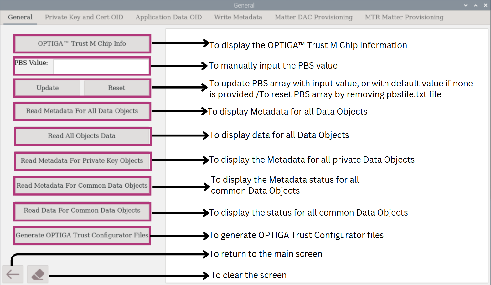
[^Figure 1]: OPTIGA™ Trust M General functions described

### Chip info

Displays the OPTIGA™ Trust M chip information. 

To read out the OPTIGA™ Trust M chip info, select "OPTIGA™ Trust M chip info" in the left panel.

```shell
Reading OPTIGA Trust M chip info

Read Chip Info [0xE0C2]: Success.
========================================================
CIM Identifier             [bCimIdentifer]: 0xcd
Platform Identifer   [bPlatformIdentifier]: 0x16
Model Identifer         [bModelIdentifier]: 0x33
ID of ROM mask                  [wROMCode]: 0x4d01
Chip Type                    [rgbChipType]: 0x00 0x1c 0x00 0x05 0x00 0x00
Batch Number              [rgbBatchNumber]: 0x0a 0x01 0x27 0x17 0x00 0x07
X-coordinate              [wChipPositionX]: 0x0025
Y-coordinate              [wChipPositionY]: 0x003b
Firmware Identifier [dwFirmwareIdentifier]: 0x80101070
Build Number                 [rgbESWBuild]: 24 40

Chip software build: 
OPTIGA(TM) Trust M rev.3; Firmware Version: 3.00.2440
========================================================

'/bin/trustm_chipinfo' executed
++++++++++++++++++++++++++++++++
```

Expected Output: Trust M chip info displayed

### PBS Value Update

When provisioning for MTR, initialize the explorer by entering the PBS value and pressing 'Update' in "General" tab to pass the value to `pal_os_datastore.c`. If the corresponding PBS value is unknown, switch to "MTR Matter Provisioning" to update the PBS value.

For the OPTIGA™ Trust V1/V3 security solution, no PBS value is required. Simply leave the 'PBS Value' field blank and press 'Update' to initiate the explorer.

Use the 'Reset' button to reset `pbsfile.txt` when needed. For example, if switching from a previously used MTR device back to V1/V3, the `pbsfile.txt` needs to be reset to the default PBS value.

### Read Metadata For All Data Objects

Displays the metadata for all data objects : *0xE0E0-0xE0E3, 0xE0E8-0xE0E9, 0xE0EF,* *0xE120-0xE123,* *0xE200*, *0xE140, 0xF1D0-0xF1DB, 0xF1E0-0xF1E1*

To read out metadata, select "Read Metadata For All Data Objects" in "General" tab.

```shell
Reading all Data Objects Metadata
===========================================
Device Public Key IFX       [0xE0E0] 
OPTIGA execution time: 0.1053 sec.
[Size 0025] : 
	20 17 C0 01 03 C4 02 06 C0 C5 02 01 DA D0 01 00 
	D1 01 00 D3 01 00 E8 01 12 
	LcsO:0x03, Max Size:1728, Used Size:474, Change:ALW, Read:ALW, Execute:ALW, Data Type:DEVCERT, 

===========================================
Device Public Key           [0xE0E1] 
OPTIGA execution time: 0.0385 sec.
[Size 0031] : 
	20 1D C0 01 07 C4 02 06 C0 C5 02 03 1E D0 07 20 
	E1 40 FD 23 F1 D0 D1 01 00 D3 01 00 E8 01 12 
	LcsO:0x07, Max Size:1728, Used Size:798, Change:Conf-0xE140&&Auto-0xF1D0, Read:ALW, Execute:ALW, Data Type:DEVCERT, 

===========================================
Device Public Key           [0xE0E2] 
OPTIGA execution time: 0.0374 sec.
[Size 0031] : 
	20 1D C0 01 07 C4 02 06 C0 C5 02 04 72 D0 07 20 
	E1 40 FD 23 F1 D0 D1 01 00 D3 01 00 E8 01 12 
	LcsO:0x07, Max Size:1728, Used Size:1138, Change:Conf-0xE140&&Auto-0xF1D0, Read:ALW, Execute:ALW, Data Type:DEVCERT, 
......
 '/bin/trustm_readmetadata_data' executed
++++++++++++++++++++++++++++++++
```

Expected Output (Partial): Metadata for all data objects displayed

### Read All Objects Data

To Display the data for all data objects : *0xE0E0-0xE0E3, 0xE0E8-0xE0E9, 0xE0EF,*  *0xE120-0xE123,* *0xE200*, *0xE140, 0xF1D0-0xF1DB, 0xF1E0-0xF1E1*

To read data, select "Read All Objects Data" in "General" tab.

```shell
Reading Data for all Data Objects

========================================================
Device Public Key IFX       [0xE0E0] 
OPTIGA execution time: 0.1740 sec.
[Size 0474] : 
	30 82 01 D6 30 82 01 7B A0 03 02 01 02 02 04 0A 
	EC FA 6E 30 0A 06 08 2A 86 48 CE 3D 04 03 02 30 
	39 31 37 30 35 06 03 55 04 03 13 2E 4B 75 64 65 
	......
========================================================
Device Public Key           [0xE0E1] 
OPTIGA execution time: 0.1403 sec.
[Size 0798] : 
	C0 03 1B 00 03 18 00 03 15 30 82 03 11 30 82 02 
	96 A0 03 02 01 02 02 04 42 19 8A 83 30 0A 06 08 
	2A 86 48 CE 3D 04 03 03 30 72 31 0B 30 09 06 03 
	.......
========================================================

 '/bin/trustm_read_data' executed
++++++++++++++++++++++++++++++++
```
Expected Output (Partial): Data of all data objects displayed

### Read Metadata For Private Key Objects

To Display the metadata for all private data objects *: 0xE0F0-0xE0F3,* *0xF1FC-0xE0FD*

To read metadata for private key slot, select "Read Metadata For Private Key Objects".

```shell
Reading Metadata of all Private Data Objects

========================================================
Device EC Private Key 1         [0xE0F0] 
OPTIGA execution time: 0.0894 sec.
[Size 0023] : 
	20 15 C0 01 07 D0 07 20 E1 40 FD 23 F1 D0 D3 01 
	00 E0 01 03 E1 01 11 
	LcsO:0x07, Change:Conf-0xE140&&Auto-0xF1D0, Execute:ALW, Algorithm:ECC256, Key Type:Auth/Sign, 

========================================================
Device EC Private Key x         [0xE0F1] 
OPTIGA execution time: 0.0228 sec.
[Size 0023] : 
	20 15 C0 01 07 D0 07 20 E1 40 FD 23 F1 D0 D3 01 
	00 E0 01 03 E1 01 11 
	LcsO:0x07, Change:Conf-0xE140&&Auto-0xF1D0, Execute:ALW, Algorithm:ECC256, Key Type:Auth/Sign, 

========================================================
......

'/bin/trustm_readmetadata_private' executed
++++++++++++++++++++++++++++++++
```

Expected Output (Partial): Metadata for private key data objects displayed

### Read Metadata For Common Data Objects

Displays the metadata status of common data objects *: 0xE0C0-0xE0C6,*  *0xF1C0-0xF1C2*

To read metadata status, select "Read Metadata For Common Data Objects".

```shell
Reading Metadata Status of all Data Objects

========================================================
Global Life Cycle Status    [0xE0C0] 
OPTIGA execution time: 0.0886 sec.
[Size 0014] : 
	20 0C C4 01 01 C5 01 01 D0 01 00 D1 01 00 
	Max Size:1, Used Size:1, Change:ALW, Read:ALW, 

========================================================
Global Security Status      [0xE0C1] 
OPTIGA execution time: 0.0357 sec.
[Size 0011] : 
	20 09 C4 01 01 D0 01 00 D1 01 00 
	Max Size:1, Change:ALW, Read:ALW, 

========================================================
UID                         [0xE0C2] 
OPTIGA execution time: 0.0296 sec.
[Size 0011] : 
	20 09 C4 01 1B D0 01 FF D1 01 00 
	Max Size:27, Change:NEV, Read:ALW, 

......

'/bin/trustm_readmetadata_status' executed
++++++++++++++++++++++++++++++++
```

Expected Output (Partial): Metadata status for common data objects displayed

### Read Data For Common Data Objects

Displays the status of common data objects *: 0xE0C0-0xE0C6,*  *0xF1C0-0xF1C2*

To read data status, select "Read Data For Common Data Objects". 

```shell
Reading Status of all Data Objects

========================================================
Global Life Cycle Status    [0xE0C0] 
OPTIGA execution time: 0.1154 sec.
[Size 0001] : 	07 
Global Security Status      [0xE0C1] 
OPTIGA execution time: 0.0417 sec.
[Size 0001] : 	20 
UID                         [0xE0C2] 
OPTIGA execution time: 0.0505 sec.
[Size 0027] : 
	CD 16 33 4D 01 00 1C 00 05 00 00 0A 01 27 17 00 
	07 00 25 00 3B 80 10 10 70 24 40 
Sleep Mode Activation Delay [0xE0C3] 
OPTIGA execution time: 0.0330 sec.
[Size 0001] : 	14 
Current Limitation          [0xE0C4] 
OPTIGA execution time: 0.0331 sec.
[Size 0001] : 	06 
Security Event Counter      [0xE0C5] 
OPTIGA execution time: 0.0434 sec.
......
========================================================

'/bin/trustm_read_status' executed
++++++++++++++++++++++++++++++++
```

Expected Output (Partial): Data Status of common data objects displayed

### Generate OPTIGA Trust Configurator Files

Generates configurations files to be imported to OPTIGA Trust Configurator tool from Infineon.

> **Note**:
> OPTIGA Trust Configurator(OTC) is a tool which can be used to generate customer specific configurations for Infineon Secure Elements. The OTC files generated here can be imported into Infineon OPTIGA Trust Configurator to create custom security chip configurations. Please go to Infineon website to download OPTIGA Trust Configurator for final configuration.

To generate OTC Files, select "Generate OPTIGA Trust Configurator Files"

Select directory to save the generated OTC Files in the save file dialog. By default, the generated OTC files are compiled under `OPTIGA_Trust_M_V3_SLS32AIA010ML_K_Infineon_Technologies/` directory


[^Figure 2]: OTC File save dialog

>**Note**:
> OTC Files generation could take up to a minute

After finished, the screen will also show the directory of the generated OTC file

```shell
Exporting the configuration of all data objects
Exporting data from OID E0C0 ... done
Exporting metadata from OID E0C0 ... done
Exporting data from OID E0C1 ... done
Exporting metadata from OID E0C1 ... done
Exporting metadata from OID E0C2 ... done
Exporting metadata from OID E0C5 ... done
Exporting data from OID E0C6 ... done
Exporting metadata from OID E0C6 ... done
......
Exporting metadata from OID E0F1 ... done
Exporting metadata from OID E0F2 ... done
Exporting metadata from OID E0F3 ... done
Exporting metadata from OID E0FC ... done
Exporting metadata from OID E0FD ... done
Exporting metadata from OID E200 ... done
+++++++++++++++++++++++++++++++++++++++++++++++++++++
Generated OTC file at /home/pi/optiga-trust-m-explorer/Python_TrustM_GUI/working_space/OPTIGA_Trust_M_V3_SLS32AIA010ML_K_Infineon_Technologies
+++++++++++++++++++++++++++++++++++++++++++++++++++++
```
Expected Output (Partial): OTC generation completed

## Private Key and Cert OID

This section shows you the Private Key and Certificate OID management of the OPTIGA™ Trust M. It is used to read metadata of the Private keys , read out Certificate metadata, Certificate Data and write Certificate's  into data objects.

### Functions 

Private Key and Cert OID functions Description

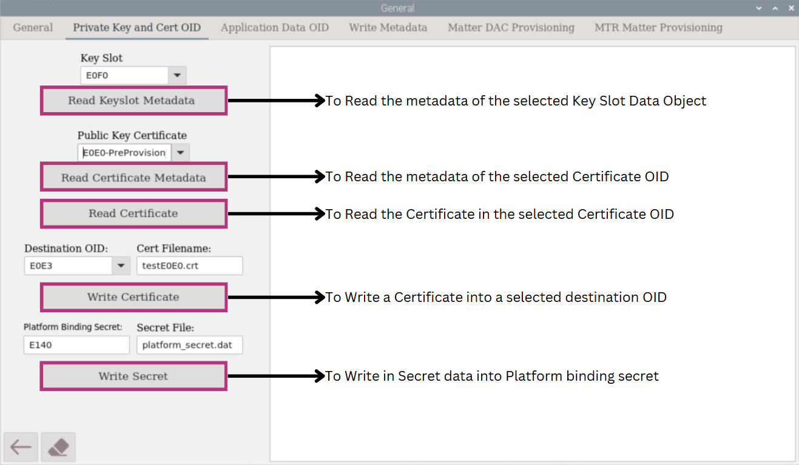

[^Figure 3]:Private Key and Cert OID functions described

### Read Key Slot Metadata

Reads out the Metadata of the selected Key Slot Data Object. Key Slot data objects :*0xE0F0 - 0xE0F3*, *0xE0FC-0xE0FD*, *0xE200*

Key Slot Data Objects are data objects used by the Cryptographic Application. 

To read metadata of the key slot, select the Key Slot. Then select  "Read Key Slot Metadata". In this example Key Slot data object : *0xE0F0*

```shell
Reading out Metadata of OPTIGAâ„¢ TrustM's Key Slot E0F0 ....

========================================================
Device EC Private Key 1         [0xE0F0] 
OPTIGA execution time: 0.0905 sec.
[Size 0023] : 
	20 15 C0 01 07 D0 07 20 E1 40 FD 23 F1 D0 D3 01 
	00 E0 01 03 E1 01 11 
	LcsO:0x07, Change:Conf-0xE140&&Auto-0xF1D0, Execute:ALW, Algorithm:ECC256, Key Type:Auth/Sign, 

========================================================
'trustm_metadata -r 0xE0F0' executed 
++++++++++++++++++++++++++++++++++++++++++++
```

Expected Output: Key slot metadata displayed 

### Read Certificate Metadata

The Public Key Certificate data objects are used to store Certificates. 

To read out metadata of a selected Public key Certificate data object, select "Read Certificate Metadata". In this example, *0xE0E0* is selected 

```shell
Reading out Metadata for OPTIGAâ„¢ TrustM's Public Cert E0E0-PreProvisioned....

========================================================
Device Public Key IFX       [0xE0E0] 
OPTIGA execution time: 0.1063 sec.
[Size 0025] : 
	20 17 C0 01 03 C4 02 06 C0 C5 02 01 DA D0 01 00 
	D1 01 00 D3 01 00 E8 01 12 
	LcsO:0x03, Max Size:1728, Used Size:474, Change:ALW, Read:ALW, Execute:ALW, Data Type:DEVCERT, 

========================================================
'trustm_metadata -r 0xE0E0' executed 
++++++++++++++++++++++++++++++++++++++++++++
```

Expected Output: Certificate Metadata displayed 

### Read Certificate

Read the Certificate Data stored inside the selected data objects : *0xE0E0 - 0XE0E3*, *0XE0F8 - 0XE0F9*

To read out the certificate data stored inside, select the Public Key Certificate data object , from the options,  then select "Read Certificate".

```shell
Reading out data stored in OPTIGAâ„¢ TrustM's Public Cert: E0E0-PreProvisioned....

========================================================
Device Public Key IFX       [0xE0E0] 
OPTIGA execution time: 0.2687 sec.
[Size 0474] : 
	30 82 01 D6 30 82 01 7B A0 03 02 01 02 02 04 0A 
	EC FA 6E 30 0A 06 08 2A 86 48 CE 3D 04 03 02 30 
	39 31 37 30 35 06 03 55 04 03 13 2E 4B 75 64 65 
	6C 73 6B 69 20 54 65 73 74 20 50 41 49 20 66 6F 
    ......
========================================================
'trustm_data -r 0xE0E0' executed 
++++++++++++++++++++++++++++++++++++++++++++

Certificate:
    Data:
        Version: 3 (0x2)
        Serial Number: 183302766 (0xaecfa6e)
        Signature Algorithm: ecdsa-with-SHA256
        Issuer: CN = Kudelski Test PAI for test-vendor Mvid:FFF1 01
        Validity
            Not Before: Jan 13 07:14:45 2025 GMT
            Not After : Dec 31 23:59:59 9999 GMT
        Subject: CN = Test Mvid:FFF1 Mpid:0003 7d7fc315-206a-46e8-8cfd-05c311ef35d1
        Subject Public Key Info:
......

openssl x509 -in testE0E0.crt -text  -noout  executed
++++++++++++++++++++++++++++++++++++++++++++
```

Expected Output (Partial): Readout Certificate displayed

### Write Certificate

Write a Certificate into the selected data object : *0xE0E1 - 0xE0E3*, *0xE0E8 - 0XE0E9*

*0xE0E0* is used to store the pre-provisioned certificate from Infineon. *0xE0E8 - 0xE0E9* is used to store the trust anchor. 

To Write Certificate, Select the Certificate filename. In this example, the testE0E0.crt Certificate file is selected. 

Select the Destination OID to write the certificate data. The Destination OID data objects list: *0xE0E1 - 0xE0E3*, *0xE0E8 - 0XE0E9* . In this example *0xE0E3* is selected. 

Select "Write Certificate" to write in certificate data into Destination OID.

```shell
Writing Certificate into OID : E0E3....
========================================================
OPTIGA execution time: 0.2490 sec.
Success!!!
========================================================
'trustm_data -w 0xE0E3-i testE0E0.crt executed 
++++++++++++++++++++++++++++++++++++++++++++
```

Expected Output: Certificate successfully written into destination OID

### Write Platform Binding Secret

Write the Platform Binding Secret into the Platform Binding Secret Data Object : *0xE140*

To Write Platform Binding Secret, Select the Secret file. In this example, platform_secret.dat is selected as the default one. Select "Write Secret" to write in the Platform Binding Secret into *0xE140*.

```shell
Writing Platform Binding Secret into 0xE140:....

Bypass Shielded Communication. 
========================================================
Shared Platform Binding Secret. [0xe140] 
Offset: 0
Input data : 
	01 02 03 04 05 06 07 08 09 0A 0B 0C 0D 0E 0F 10 
	11 12 13 14 15 16 17 18 19 1A 1B 1C 1D 1E 1F 20 
	21 22 23 24 25 26 27 28 29 2A 2B 2C 2D 2E 2F 30 
	31 32 33 34 35 36 37 38 39 3A 3B 3C 3D 3E 3F 40 
	
OPTIGA execution time: 0.0247 sec.
Write Success.
========================================================
'trustm_data -X -w 0xE140-i platform_secret.dat executed 

Bypass Shielded Communication. 
========================================================
Shared Platform Binding Secret. [0xe140] 
OPTIGA execution time: 0.0167 sec.
[Size 0064] : 
	01 02 03 04 05 06 07 08 09 0A 0B 0C 0D 0E 0F 10 
	11 12 13 14 15 16 17 18 19 1A 1B 1C 1D 1E 1F 20 
	21 22 23 24 25 26 27 28 29 2A 2B 2C 2D 2E 2F 30 
	31 32 33 34 35 36 37 38 39 3A 3B 3C 3D 3E 3F 40 
	
========================================================

'trustm_data -X -r 0xE140 ...executed 
++++++++++++++++++++++++++++++++++++++++++++

```

Expected Output: Secret Data successfully written into Platform binding secret data object

## Application Data OID

This section shows you the Application Data Objects management of the OPTIGA™ Trust M. It is used to read metadata, data of the Application Data Objects and write data into Application Data Objects 

Application data objects are the data objects used by the Protected Update and Secure Storage Applications.

### Functions 

Application Data OID functions description

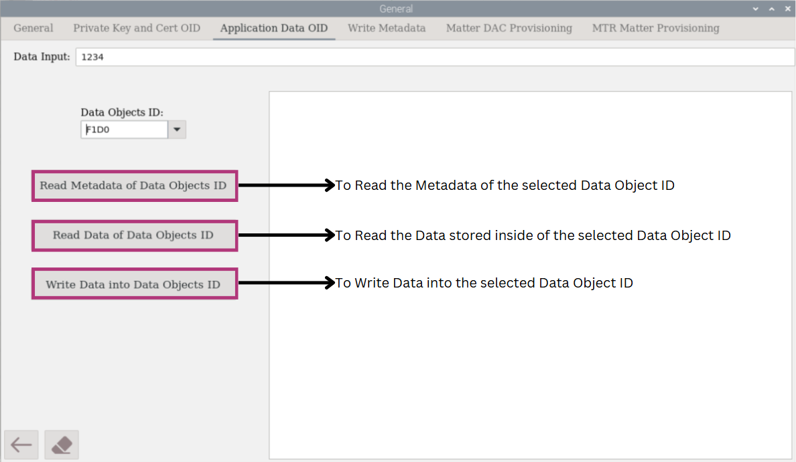

[^Figure 4]:Application Data OID functions described

### Read Metadata Of Data Objects ID

Reads the Metadata of the selected Application Data Object.  Data Objects ID : *0xF1D0 - 0xF1DB* 

To Read Metadata, select Data Objects ID . Then select "Read Metadata of Data Objects ID". In this Example Data Objects ID: *0xF1D0* is used.

```shell
Reading out Metadata of OPTIGAâ„¢ TrustM's Data Object ID F1D0....

========================================================
App DataStrucObj type 3     [0xF1D0] 
OPTIGA execution time: 0.1029 sec.
[Size 0035] : 
	20 21 C0 01 01 C1 02 00 01 C4 01 8C C5 01 08 D0 
	03 E1 FC 07 D1 01 00 D3 01 00 D8 01 FF E8 01 31 
	F0 01 01 
	LcsO:0x01, Version:0001, Max Size:140, Used Size:8, Change:LcsO<0x07, Read:ALW, Execute:ALW, MUD:NEV, Data Type:AUTHREF, Reset Type:SETCRE, 

========================================================
'trustm_metadata -r 0xF1D0' executed 
+++++++++++++++++++++++++++++++++++++++++++++++++++++++++++++++++ 
```

Expected Output: Metadata of data objects ID: *0xF1D0* displayed

### Read Data of Data Objects ID 

Reads the Data stored inside the selected Application Data Object ID.

To Read Data, select Data Objects ID . Then select "Read Metadata of Data Objects ID". In this Example Data Objects ID: *0xF1D0* is used.

```shell
Reading out data stored in OPTIGAâ„¢ TrustM's Data Object ID: F1D0....

========================================================
App DataStrucObj type 3     [0xF1D0] 
OPTIGA execution time: 0.1105 sec.
[Size 0008] : 
	70 61 73 73 77 6F 72 64 
========================================================
'trustm_data -r 0xF1D0' executed 
+++++++++++++++++++++++++++++++++++++++++++++++++++++++++++++++++ 

```

Expected Output: Data inside data objects ID: *0xF1D0* is Read out

### Write Data Into Data Objects ID

Write Data into the selected Data Object ID. 

To Write Data, enter the Data input and select the Data Object ID to write to. Then click " Write Data into Data Objects ID". For this example *0xF1D0* is selected and the data input is "1234".

```shell
========================================================
App DataStrucObj type 3     [0xF1D0] 
Offset: 0
Input data : 
	31 32 33 34 0A 
OPTIGA execution time: 0.1314 sec.
Write Success.
========================================================

'trustm_data -w 0xF1D0 -e  -i  writedata.txt ' executed 
+++++++++++++++++++++++++++++++++++++++++++++++++++++++++++++++++ 
```

Expected Output: Write Input Data into data object ID: *0xF1D0* successfully


## Write Metadata

This section shows you the Metadata management of the OPTIGA™ Trust M. It is used to read and write metadata to all Data Objects.

Data Objects available for Metadata write include Public and Private Keys, Certificates, System Data Objects, Counter Objects, Platform Binding Secrets and Application Data Objects.


### Functions

Write metadata functions description

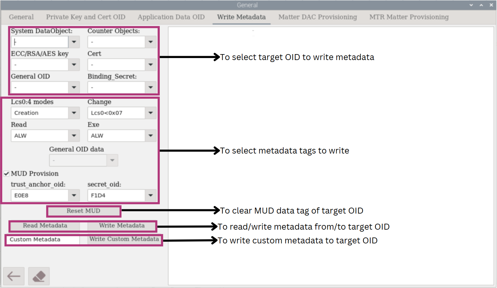
[^Figure 5]: Write Metadata functions described

### Read Metadata
Read Metadata from specified Object ID

To read metadata from an Object ID, select one Object ID from the six types of the Data Objects to read from, then click "Read Metdata". For this example *0xF1D0* is selected.

```shell
Reading out Metadata of OPTIGAâ„¢ TrustM's Data Object ID F1D1....

========================================================
App DataStrucObj type 3     [0xF1D1] 
OPTIGA execution time: 0.1100 sec.
[Size 0029] : 
	20 1B C0 01 01 C1 02 00 01 C4 01 8C C5 01 5B D0 
	03 E1 FC 07 D1 01 00 D8 01 FF F0 01 01 
	LcsO:0x01, Version:0001, Max Size:140, Used Size:91, Change:LcsO<0x07, Read:ALW, MUD:NEV, Reset Type:SETCRE, 

========================================================
'trustm_metadata -r 0xF1D1' executed 
+++++++++++++++++++++++++++++++++++++++++++++++++++++++++++++++++ 
```

Expected Output: Read Metadata from Object ID 0xF1D0

### Write Metadata
Write Metadata to specified Object ID

To write metadata to an Object ID, select target OID from one of the lists, configure metadata tags then click *Write Metadata* button. In the example, <br>
- Target OID *0xF1D5* is selected 
- *Lcs0* is *Creation* (0x01)
- *Change* is *Lcs0<0x07*
- *Read* is *Lcs0<0x0F*
- *Exe* is *Lcs0<0x07*
- *data type* is Bytestring (BTSR)

```shell
Provisioning for trust anchor metadata... 
'python3 hex_to_binary.py {TRUST_ANCHOR_META} > trust_anchor_metadata.bin' executed 
++++++++++++++++++++++++++++++++++++++++++++
Writing trust_anchor_metadata.bin as metadata of Trust Anchor OID... 

========================================================
Root CA Public Key Cert1    [0xE0E8] 

	20 03 E8 01 11 
	Data Type:TA, 
OPTIGA execution time: 0.1383 sec.
Write Success.
========================================================
'trustm_metadata -w 0x0xE0E8 -F trust_anchor_metadata.bin' executed 
++++++++++++++++++++++++++++++++++++++++++++
Provisioning for protected update secret metadata... 
'python3 hex_to_binary.py {PROTECTED_UPDATE_SECRET_META} > protected_update_secret_metadata.bin' executed 
++++++++++++++++++++++++++++++++++++++++++++
Writing protected update secret metadata into secret_oid... 
========================================================
App DataStrucObj type 3     [0xF1D4] 

	20 0B D1 03 E1 FC 07 D3 01 00 E8 01 23 
	Read:LcsO<0x07, Execute:ALW, Data Type:UPDATSEC, 
OPTIGA execution time: 0.1206 sec.
Write Success.
......
'trustm_metadata -w 0xF1D5 -Co -Rt -Eo ' executed 
++++++++++++++++++++++++++++++++++++++++++++
```
 
 Expected Output (Partial): Metadata update for OID 0xF1D5 successful


> **Note**:
> To prevent ***Lcs0*** values being irreversible, ***MUD Provision*** checkbox will be enabled by default when *Lcs0* mode is ***Operational*** or ***Termination*** <br>

> To revert changes to *Lcs0* tag, please see section [*5.1 Metadata Protected Update*](#metadata-protected-update) 

### Reset MUD
Reset Metadata Update Description (MUD) tag

To reset MUD, select target OID from one of the list, then click *Reset MUD* <br>
In the example, OID 0xF1D5 has MUD tag `MUD:Int-0xE0E8&&Conf-0xF1D4`. After Reset MUD, the tag field is `MUD:NEV`

```shell
Reading out Metadata of OPTIGAâ„¢ TrustM's Data Object ID F1D5....

========================================================
App DataStrucObj type 3     [0xF1D5] 
OPTIGA execution time: 0.1417 sec.
[Size 0043] : 
	20 29 C0 01 03 C1 02 00 00 C4 01 8C C5 01 20 D0 
	03 23 F1 D0 D1 03 23 F1 D0 D3 01 00 D8 07 21 E0 
	E8 FD 20 F1 D4 E8 01 00 F0 01 01 
	LcsO:0x03, Version:0000, Max Size:140, Used Size:32, Change:Auto-0xF1D0, Read:Auto-0xF1D0, Execute:ALW, MUD:Int-0xE0E8&&Conf-0xF1D4, Data Type:BSTR, Reset Type:SETCRE, 

========================================================
'trustm_metadata -r 0xF1D5' executed 
+++++++++++++++++++++++++++++++++++++++++++++++++++++++++++++++++ 
Resetting Metadata Update Description tag for Target OID 0xF1D5
00000000: 2003 d801 ff                             ....
mud_reset.bin generated
Writing metadata for Target OID... 
'trustm_metadata -w 0xF1D5 -F mud_reset.bin' executed 
++++++++++++++++++++++++++++++++++++++++++++
Reading out Metadata of OPTIGAâ„¢ TrustM's Data Object ID F1D5....

========================================================
App DataStrucObj type 3     [0xF1D5] 
OPTIGA execution time: 0.1396 sec.
[Size 0037] : 
	20 23 C0 01 03 C1 02 00 00 C4 01 8C C5 01 20 D0 
	03 23 F1 D0 D1 03 23 F1 D0 D3 01 00 D8 01 FF E8 
	01 00 F0 01 01 
	LcsO:0x03, Version:0000, Max Size:140, Used Size:32, Change:Auto-0xF1D0, Read:Auto-0xF1D0, Execute:ALW, MUD:NEV, Data Type:BSTR, Reset Type:SETCRE, 

========================================================
'trustm_metadata -r 0xF1D5' executed 
+++++++++++++++++++++++++++++++++++++++++++++++++++++++++++++++++ 
```

Expected Output: MUD Reset Successful

### Write Custom Metadata
Write metadata to target OID based on user's text file

To load custom metadata into target OID
- Select target OID from one of the lists
- Click the *Custom Metadata* text box to choose custom metadata file
- Double check the metadata contents to be written
- Click *Write Custom Metadata*

```shell
Contents of the custom metadata file:
00000000  20 0b c0 01 03 d1 01 00  d0 03 e1 fc 07           | ............|
0000000d
```

Expected Output: Custom metadata loaded and contents shown

```shell
Writing Metadata to OPTIGAâ„¢ TrustM's Data Object F1D5 ....

========================================================
App DataStrucObj type 3     [0xF1D5] 

	20 0B C0 01 03 D1 01 00 D0 03 E1 FC 07 
	LcsO:0x03, Read:ALW, Change:LcsO<0x07, 
OPTIGA execution time: 0.1308 sec.
Write Success.
========================================================
'trustm_metadata -w 0xF1D5 -F /home/pi/optiga-trust-m-explorer/Python_TrustM_GUI/working_space/samples/custom_metadata.bin' executed 
++++++++++++++++++++++++++++++++++++++++++++****
```

Expected Output: Custom metadata write success

## Matter Test DAC Provisioning
This section shows you the Test DAC Provisioning for Matter devices using the OPTIGA™ Trust M for Device Attestation. It involves reading a pre-provisioned certificate from the chip, extracting the public key, generating a new DAC certificate signed by a trusted Matter CA and writing the Test DAC certificate, Matter Test PAI and Test CD into the Object IDs.

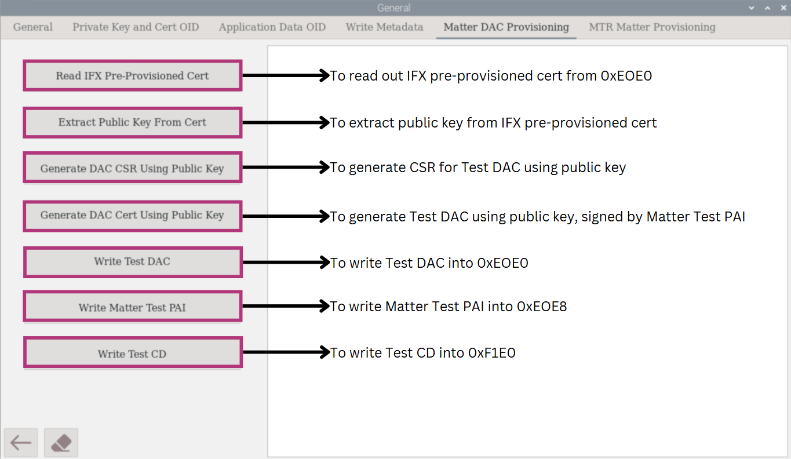
[^Figure 6]: Matter DAC Provisioning functions described

### Read Pre-Provisioned Cert
Reads IFX pre-provisioned certificate from OID 0xE0E0

To read the IFX pre-provisioned certificate, select "Read IFX Pre-Provisioned Cert".

```shell
Read ifx pre-provisioned cert from 0xe0e0

Bypass Shielded Communication. 
========================================================
OID              : 0xE0E0 
Output File Name : ifx_cert_e0e0.pem 
OPTIGA execution time: 0.0881 sec.
First byte: 30, last byte: 4a, cer Length: 501
Success!!!
========================================================

'/bin/trustm_cert -r 0xe0e0 -o ifx_cert_e0e0.pem -X' executed
Certificate:
    Data:
        Version: 3 (0x2)
        Serial Number:
            56:e5:9a:b5:df:73:36:40:09:4e:88:b3:f3:40:98:a9:f8:a8:2b:c3
        Signature Algorithm: ecdsa-with-SHA256
        Issuer: CN = Matter Dev PAI 0xFFF1 no PID, 1.3.6.1.4.1.37244.2.1 = FFF1
        Validity
            Not Before: Feb 24 05:25:58 2025 GMT
            Not After : Jul  9 05:25:58 2026 GMT
        Subject: CN = Matter Dev DAC 0xFFF1/0x8006, 1.3.6.1.4.1.37244.2.1 = FFF1, 1.3.6.1.4.1.37244.2.2 = 8006
        Subject Public Key Info:
            Public Key Algorithm: id-ecPublicKey
                Public-Key: (256 bit)
                pub:
                    04:2d:7a:c3:64:55:43:a7:0b:9e:b5:11:af:30:be:
                    09:f4:3b:b6:91:4b:68:32:26:df:87:92:c6:15:95:
......
'openssl x509 -in ifx_cert_e0e0.pem -text -noout' executed
++++++++++++++++++++++++++++++++
```

Expected Output (Partial): Displays information about the pre-provisioned certificate

### Extract Public Key From Cert
Extracts the public key from the certificate and saves it to a file named pubkey_e0e0.pem.

To extract the public key from the certificate, select "Extract Public Key From Cert".

```shell
Extracting public key from cert

'openssl x509 -pubkey -noout -in ifx_cert_e0e0.pem' executed
-----BEGIN PUBLIC KEY-----
MFkwEwYHKoZIzj0CAQYIKoZIzj0DAQcDQgAELXrDZFVDpwuetRGvML4J9Du2kUto
Mibfh5LGFZUEvLYu+ot7m3QtoQ6hk7Km36buVpaNamg6NmaAwWMDwdIAag==
-----END PUBLIC KEY-----

'cat pubkey_e0e0.pem' executed
++++++++++++++++++++++++++++++++
```

Expected Output: Displays the public key extracted from the certificate

### Generate DAC CSR
Generates a Certificate Signing Request(CSR) using the public key.

To generate the CSR, select "Generate DAC CSR Using Public Key".

```shell
Generating DAC csr using public key

.........+...+..............+...+.+..+.........+.+..+++++++++++++++++++++++++++++++++++++++++++++++++++++++++++++++++*....+...+......+...+..+...+...+...+.+...........+...+.........+......+......+.+...+......+...+...+..+.......+.....+....+..+.......+..+....+..+....+...............+++++++++++++++++++++++++++++++++++++++++++++++++++++++++++++++++*...+...+...+....+........+......+++++++++++++++++++++++++++++++++++++++++++++++++++++++++++++++++
.+..+...+...............+.......+...+...+........+..........+..+.........+...+++++++++++++++++++++++++++++++++++++++++++++++++++++++++++++++++*...+...+.......+...+.....+.+.....+......+...+.+........+...+.......+++++++++++++++++++++++++++++++++++++++++++++++++++++++++++++++++*.....+.........+.+.....+.+..+...+.......+..+++++++++++++++++++++++++++++++++++++++++++++++++++++++++++++++++
-----

'openssl req -new -newkey rsa:2048 -nodes -keyout private.key -out request.csr -config openssl_matter.cnf' executed
++++++++++++++++++++++++++++++++
```

Expected Output: CSR generated from the public key

### Generate DAC Cert
Generates a new DAC certificate by signing the CSR with the Matter Test PAI certificate.

To generate the certificate, select "Generate DAC Cert Using Public Key".

```shell
Generating DAC certificate using public key, Signed by Matter test PAI
Certificate request self-signature ok
subject=CN = Matter Dev DAC 0xFFF1/0x8006, 1.3.6.1.4.1.37244.2.1 = FFF1, 1.3.6.1.4.1.37244.2.2 = 8006

 'openssl x509 -req -in request.csr -extfile v3.ext -CA credentials/Matter-Development-PAI-noPID-Cert.pem -CAkey credentials/Matter-Development-PAI-noPID-Key.pem -CAcreateserial -out DAC_Cert.pem -days 500 -sha256 -force_pubkey pubkey_e0e0.pem' executed
++++++++++++++++++++++++++++++++
```

Expected Output: DAC certificate generated from the public key

### Write DAC Cert
Writes the new DAC certificate to OID 0xE0E0.
To write the new DAC certificate into 0xE0E0, select "Write Test DAC".

```shell
Write test DAC into 0xe0e0
Bypass Shielded Communication. 
========================================================
OPTIGA execution time: 0.1220 sec.
Success!!!
========================================================

 'trustm_metadata -w 0xe0e0 -Ca -X' executed

 'trustm_cert -w 0xe0e0 -i DAC_Cert.pem -X' executed

Displaying DAC
Certificate:
    Data:
        Version: 3 (0x2)
        Serial Number:
            47:39:69:39:05:7f:f7:70:df:33:d8:ec:e7:f7:2c:b2:e1:88:bd:17
        Signature Algorithm: ecdsa-with-SHA256
        Issuer: CN = Matter Dev PAI 0xFFF1 no PID, 1.3.6.1.4.1.37244.2.1 = FFF1
        Validity
            Not Before: Jun 26 08:17:38 2025 GMT
            Not After : Nov  8 08:17:38 2026 GMT
......
++++++++++++++++++++++++++++++++
```

 Expected Output (Partial): Displays information of the new DAC certificate

### Write Matter Test PAI
Writes the Matter Test PAI certificate to OID 0xE0E8.
To write the Matter Test PAI into 0xE0E8, select "Write Matter Test PAI".

```shell
Write Matter test PAI into 0xe0e8
Bypass Shielded Communication. 
========================================================
OPTIGA execution time: 0.0942 sec.
Success!!!
========================================================

'trustm_cert -w 0xe0e8 -i credentials/Matter-Development-PAI-noPID-Cert.pem -X' executed
++++++++++++++++++++++++++++++++
```

Expected Output: Matter Test PAI written to 0xE0E8.

### Write Test CD
Writes the Test CD to OID 0xF1E0.
To write Test CD into 0xF1E0, select "Write Test CD".

```shell
Write test CD into 0xf1e0

Bypass Shielded Communication. 
========================================================
App DataStrucObj type 2     [0xF1E0] 
Offset: 0
Input data : 
	30 82 02 19 06 09 2A 86 48 86 F7 0D 01 07 02 A0 
	82 02 0A 30 82 02 06 02 01 03 31 0D 30 0B 06 09 
	60 86 48 01 65 03 04 02 01 30 82 01 71 06 09 2A 
	......
OPTIGA execution time: 0.1824 sec.
Write Success.
========================================================

'trustm_data -e -w 0xf1e0 -i credentials/Chip-Test-CD-Cert.bin -X' executed
++++++++++++++++++++++++++++++++
```

Expected Output (Partial): Test CD written to 0xF1E0.

## MTR Matter Provisioning

This section outlines the Matter Provisioning process for MTR using the OPTIGA™ Trust M for Device Attestation. Provisioning begins by updating the PBS array. Once the bundle file is selected and the transport key is obtained, the user can retrieve the corresponding Auto and PBS values for the specific Chip ID. These values facilitate writing the Device Attestation Certificate (DAC) and Product Attestation Intermediate (PAI) to the secure element. The user will also be able to write the Certificate Declaration (CD) during this session, although writing CD does not require the PBS or Auto values. Additionally, the user can choose to set the device to operational mode.

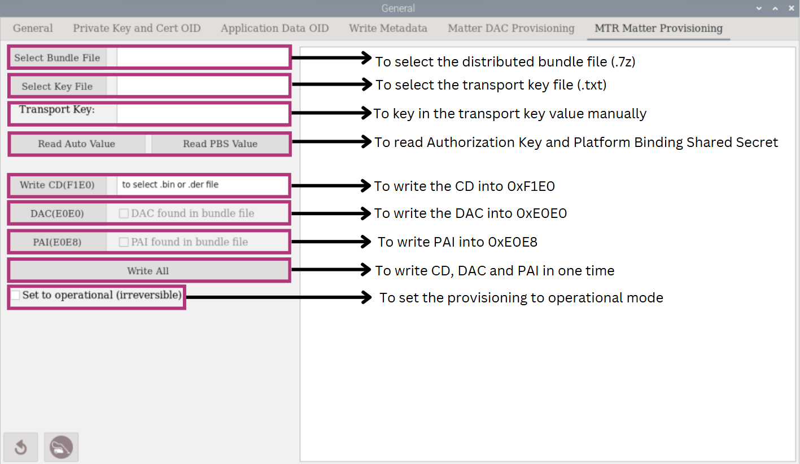

[^Figure 7]: MTR Matter Provisioning functions described

### Initialize MTR Matter Provisioning

To initialize MTR Matter Provisioning, update the PBS array in `pal_os_datastore.c` with the corresponding value. First, select the distributed bundle file from local storage. Then, provide the transport key by either uploading a `.txt` file or entering the transport key value manually. Once the transport key is obtained, press 'Update PBS' to pass the corresponding PBS value to `pal_os_datastore.c`.

```shell
PBSfile updated with value:6A9145390FB22A1FCD907465EEBB2E4E006783C7A********************3EBDD7736F6738C6CBCBCDE43B5D08244B71EC6702FF547CB5B7D3FE09DAC5BEF80
```

Expected Output: MTR PBS array updated with sample value
### Read Auto and PBS Value

The corresponding Auto and PBS values are retrieved from the bundle file based on the unique device Chip ID.

After selecting the bundle file and obtaining the transport key, click 'Read Auto Value' and 'Read PBS Value' to print them out.

```shell
Auto Value: E9E1E6D4F233A5BB84057DBB261F8DF305C15B29E********************49F5F7D780CC690E28FD31E5698B82BB2C218CE47540D2A09A43EDF700EF74A059A

PBS Value: 6A9145390FB22A1FCD907465EEBB2E4E006783C7A********************3EBDD7736F6738C6CBCBCDE43B5D08244B71EC6702FF547CB5B7D3FE09DAC5BEF80
```

Expected Output: Displays the sample auto and PBS value

### Write CD

Writes the CD to OID 0xF1E0. Select a CD cert which should be either in .bin or .der format. Select "Write CD(F1E0)" to print the writing result. "Write success" and "Read back CD and verify success" will be printed when CD is written successfully.

```shell
Write CD into 0xf1e0

Bypass Shielded Communication. 
========================================================
App DataStrucObj type 2     [0xF1E0] 
Offset: 0
Input data : 
	30 82 02 19 06 09 2A 86 48 86 F7 0D 01 07 02 A0 
	82 02 0A 30 82 02 06 02 01 03 31 0D 30 0B 06 09 
	60 86 48 01 65 03 04 02 01 30 82 01 71 06 09 2A 
	86 48 86 F7 0D 01 07 01 A0 82 01 62 04 82 01 5E 
	15 24 00 01 25 01 F1 FF 36 02 05 00 80 05 01 80 
	05 02 80 05 03 80 05 04 80 05 05 80 05 06 80 05 
	07 80 05 08 80 05 09 80 05 0A 80 05 0B 80 05 0C 
	80 05 0D 80 05 0E 80 05 0F 80 05 10 80 05 11 80 
	......
OPTIGA execution time: 0.1275 sec.
Write Success.
========================================================

Read back CD and verify success!
```
 
 Expected Output (Partial): Displays information of the new CD and writing result.

### Write DAC

Writes the DAC to OID 0xE0E0. By selecting "DAC(E0E0)", GUI will start to search the DAC .pem file inside the bundle file. If it exists, checkbox "DAC found in bundle file" will be enabled automatically. "Write success" and "Read back DAC and verify success" will be printed when DAC is written successfully.

```shell
Write DAC into 0xe0e0
========================================================
Certificate:
    Data:
        Version: 3 (0x2)
        Serial Number: 183302766 (0xaecfa6e)
        Signature Algorithm: ecdsa-with-SHA256
        Issuer: CN = Kudelski Test PAI for test-vendor Mvid:FFF1 01
        Validity
            Not Before: Jan 13 07:14:45 2025 GMT
            Not After : Dec 31 23:59:59 9999 GMT
        Subject: CN = Test Mvid:FFF1 Mpid:0003 7d7fc315-206a-46e8-8cfd-05c311ef35d1
        Subject Public Key Info:
            Public Key Algorithm: id-ecPublicKey
                Public-Key: (256 bit)
                pub:
                    04:7b:29:4b:36:a0:91:d4:31:40:ea:c7:f2:9f:06:
                    ae:b4:ea:25:53:15:99:2c:cb:16:f4:ed:5e:12:49:
......
========================================================

Read back DAC and verify success!
```

Expected Output (Partial): Displays information of the new DAC and writing result.

### Write PAI

Writes the PAI to OID 0xE0E8. By selecting "PAI(E0E8)", GUI will start to search the PAI .pem file inside the bundle file. If it exists, checkbox "PAI found in bundle file" will be enabled automatically. "Write success" and "Read back PAI and verify success" will be printed when PAI is written successfully.

```shell

Write PAI into 0xe0e8
========================================================
Certificate:
    Data:
        Version: 3 (0x2)
        Serial Number:
            78:8a:f9:be:df:05:8d:ef:78:5e:4b:51:7a:f7:72:af
        Signature Algorithm: ecdsa-with-SHA256
        Issuer: CN = Kudelski Matter Test PAA 02
        Validity
            Not Before: Jan 13 07:14:45 2025 GMT
            Not After : Dec 31 23:59:59 9999 GMT
        Subject: CN = Kudelski Test PAI for test-vendor Mvid:FFF1 01
        Subject Public Key Info:
            Public Key Algorithm: id-ecPublicKey
                Public-Key: (256 bit)
                pub:
                    04:ce:5e:d1:c7:88:e4:0b:be:cd:16:72:e5:20:29:
                    af:c9:6d:ed:a8:31:96:12:05:e2:e9:18:94:19:91:
......
========================================================

Read back PAI and verify success!
```

Expected Output (Partial):Displays information of the new PAI and writing result.

### Write All

Writes the CD, DAC, and PAI to their corresponding OIDs in one operation. Select 'Write All' to write them in sequence. Once the writing process is complete and verification passes, 'Write All Operation Completed Successfully' will be displayed.

```shell

=== Starting Write All Operation ===

Write CD into 0xf1e0

Bypass Shielded Communication. 
========================================================
App DataStrucObj type 2     [0xF1E0] 
Offset: 0
Input data : 
	30 82 02 19 06 09 2A 86 48 86 F7 0D 01 07 02 A0 
......
OPTIGA execution time: 0.2014 sec.
Write Success.
========================================================

Read back CD and verify success!

Write DAC into 0xe0e0
========================================================
Certificate:
    Data:
        Version: 3 (0x2)
        Serial Number: 183302766 (0xaecfa6e)
        Signature Algorithm: ecdsa-with-SHA256
......
========================================================

Read back DAC and verify success!

Write PAI into 0xe0e8
========================================================
Certificate:
    Data:
        Version: 3 (0x2)
        Serial Number:
            78:8a:f9:be:df:05:8d:ef:78:5e:4b:51:7a:f7:72:af
        Signature Algorithm: ecdsa-with-SHA256
        Issuer: CN = Kudelski Matter Test PAA 02
        Validity
......
========================================================

Read back PAI and verify success!

=== Write All Operation Completed Successfully and Verification Passes===
```
Expected Output (Partial): Displays information of the writing result for all.
### Operational Mode (Under development)

Check the box "Set to operational (irreversible)" to set OID 0xF1E0,0xE0E0 and 0xE0E8 to operational **which is irreversible**. The OID change condition will be set to conf:E140.


# Cryptographic Functions

This section shows you the Cryptographic Functions of the OPTIGA™ Trust M. It can be used to generate keys , encrypt/decrypt and sign/verify using Trust M library.

## ECC Cryptographic Function

This section shows the use of the  OPTIGA™ Trust M ECC Cryptographic functions such as ECC key generation, ECC sign and verify.

Select "ECC"

### ECC Functions

ECC function Description

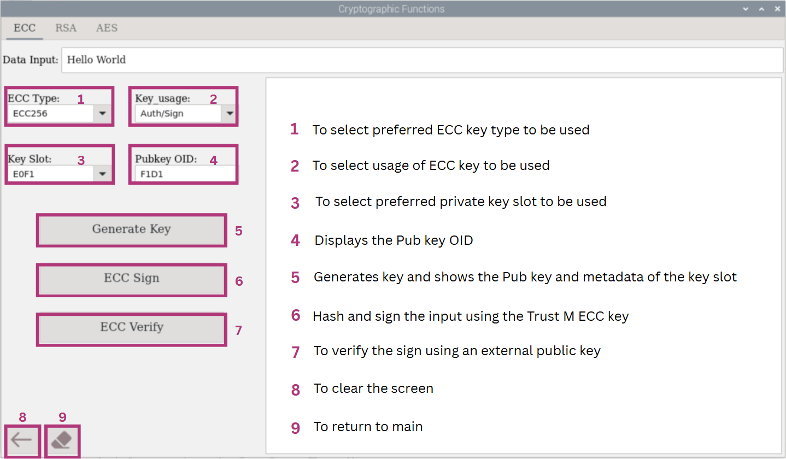

[^Figure 8]: ECC cryptographic functions described

### ECC Key Generation

Generates OPTIGA™ Trust M ECC key pair. 

ECC type is the ECC Key type to be generated. Key slot is the OID that will be used to store the private key . Once key slot is selected, the public key OID will be displayed. The public key OID will be used to store the public key of the ECC keypair after it is generated.

ECC Types : *ECC 256, ECC 384, ECC 521*, *Brainpool 256, Brainpool 384 ,Brainpool 512* ,  Key Slot : *0xE0F0 - 0xE0F3*  

To generate ECC key pair, select the ECC type, Key slot and Key_usage. Then select "Generate Key"  In this Example, "*ECC type: 256*" ,"*Key slot: E0F1*" and "*key_usage:Auth/Sign*" are used. The public Key will be stored into corresponding OID which has been displayed in the GUI. 

```shell
========================================================
Generating Key to 0xE0F1
Output File Name : test_e0f1_pub.pem 
OPTIGA execution time: 0.3027 sec.
Pubkey :
	30 59 30 13 06 07 2A 86 48 CE 3D 02 01 06 08 2A 
	86 48 CE 3D 03 01 07 03 42 00 04 CA 12 E4 A8 B0 
	27 4C 9C 6D 04 8D 06 C1 D5 58 7E 77 63 8A 2E DE 
	D1 C5 C6 B8 C5 5A C9 38 FF ED F5 7B 2F A8 E7 D3 
	CB 6F 33 3C FD D3 1C E2 64 82 84 44 74 02 06 D5 
	F2 CD E0 EE 73 64 89 CC 15 93 B6 
Write Success to OID: 0xF1D1.
========================================================
-----BEGIN PUBLIC KEY-----
MFkwEwYHKoZIzj0CAQYIKoZIzj0DAQcDQgAEyhLkqLAnTJxtBI0GwdVYfndjii7e
0cXGuMVayTj/7fV7L6jn08tvMzz90xziZIKERHQCBtXyzeDuc2SJzBWTtg==
-----END PUBLIC KEY-----

========================================================
App DataStrucObj type 3     [0xF1D1] 
OPTIGA execution time: 0.1563 sec.
[Size 0091] : 
	30 59 30 13 06 07 2A 86 48 CE 3D 02 01 06 08 2A 
	86 48 CE 3D 03 01 07 03 42 00 04 CA 12 E4 A8 B0 
	27 4C 9C 6D 04 8D 06 C1 D5 58 7E 77 63 8A 2E DE 
	D1 C5 C6 B8 C5 5A C9 38 FF ED F5 7B 2F A8 E7 D3 
	CB 6F 33 3C FD D3 1C E2 64 82 84 44 74 02 06 D5 
	F2 CD E0 EE 73 64 89 CC 15 93 B6 
========================================================

========================================================
Device EC Private Key x         [0xE0F1] 
OPTIGA execution time: 0.1420 sec.
[Size 0029] : 
	20 1B C0 01 01 C1 02 00 00 D0 03 E1 FC 07 D1 01 
	00 D3 01 00 D8 01 FF E0 01 03 E1 01 11 
	LcsO:0x01, Version:0000, Change:LcsO<0x07, Read:ALW, Execute:ALW, MUD:NEV, Algorithm:ECC256, Key Type:Auth/Sign, 

========================================================
```

Expected Output: ECC256 key inside 0xE0F1 generated successfully 

### ECC Sign

Hashes and signs the input using the OPTIGA™ Trust M ECC keypair

To Sign the data using ECC , select ECC type and key slot then click "ECC Sign" . In this Example, "ECC type: 256" and "Key slot: E0F1" are used. 

```shell
'echo Hello World > data_input.txt' executed 

Hash Algorithm: sha256
Bypass Shielded Communication. 
========================================================
OID Key          : 0xE0F1
Output File Name : ecc_signature.bin 
Input File Name  : data_input.txt 
Hash Success: sha256
	D2 A8 4F 4B 8B 65 09 37 EC 8F 73 CD 8B E2 C7 4A 
	DD 5A 91 1B A6 4D F2 74 58 ED 82 29 DA 80 4A 26 
	
OPTIGA execution time: 0.1625 sec.
Success
========================================================
'trustm_ecc_sign -k 0xe0f1 -o ecc_signature.bin -i data_input.txt -H -X' executed 
00000000: 3046 0221 0087 f9e4 e16b 30be c0e0 9241 0F.!.....k0....A
00000010: 77e0 d170 6c09 14fd 1649 b66d bd14 6b7e w..pl....I.m..k~
00000020: deb7 01ea 7e02 2100 b4e6 857c 7ece d7d8 ....~.!....|~...
00000030: d422 6b37 acd1 cd62 108f 18b1 81fe b676 ."k7...b.......v
00000040: 3df3 d0a7 e252 2ea0                     =....R..
'python3 emulator.py ecc_signature.bin' executed 
++++++++++++++++++++++++++++++++++++++++++++
```

 Expected Output: ECC 256 key signed successfully

### ECC Verify

To verify the signature using the public key generated, select the ECC type and key slot to verify.  In this Example, "ECC type: 256" and "Key slot: E0F1" are used.

```shell
'echo Hello World > data_input.txt' executed 

========================================================
App DataStrucObj type 3     [0xF1D1] 
OPTIGA execution time: 0.1158 sec.
[Size 0091] : 
	30 59 30 13 06 07 2A 86 48 CE 3D 02 01 06 08 2A 
	86 48 CE 3D 03 01 07 03 42 00 04 CA 12 E4 A8 B0 
......
Output to test_e0f1_pub.bin
========================================================
'openssl ec -pubin -inform DER -in test_e0f1_pub.bin -outform PEM -out test_e0f1_pub.pem' executed 

Hash Algorithm: sha256
Bypass Shielded Communication. 
========================================================
	D2 A8 4F 4B 8B 65 09 37 EC 8F 73 CD 8B E2 C7 4A 
	DD 5A 91 1B A6 4D F2 74 58 ED 82 29 DA 80 4A 26 
	
Pubkey file         : test_e0f1_pub.pem
Input File Name     : data_input.txt 
Signature File Name : ecc_signature.bin 
Hash Digest : 
	D2 A8 4F 4B 8B 65 09 37 EC 8F 73 CD 8B E2 C7 4A 
.......
OPTIGA execution time: 0.1818 sec.
Verify Success.
========================================================
'trustm_ecc_verify -i data_input.txt -s ecc_signature.bin -p test_e0f1_pub.pem -H -X' executed 
++++++++++++++++++++++++++++++++++++++++++++
```

Expected Output (Partial): ECC verification done successfully

### ECC Errors

The following error messages will be displayed if the verification failed.

```shell
2820:Error [0x802C] : OPTIGA device Signature Verification Failure
```

 Expected Output: ECC verification failure

## RSA Cryptographic Functions

This section shows RSA1024/2048 Key Generation, Data Encryption and Decryption using RSA key generated by OPTIGA™ Trust M.

Open the "Cryptographic Functions" Tab

Select 'RSA'

### RSA Functions

RSA Functions Description

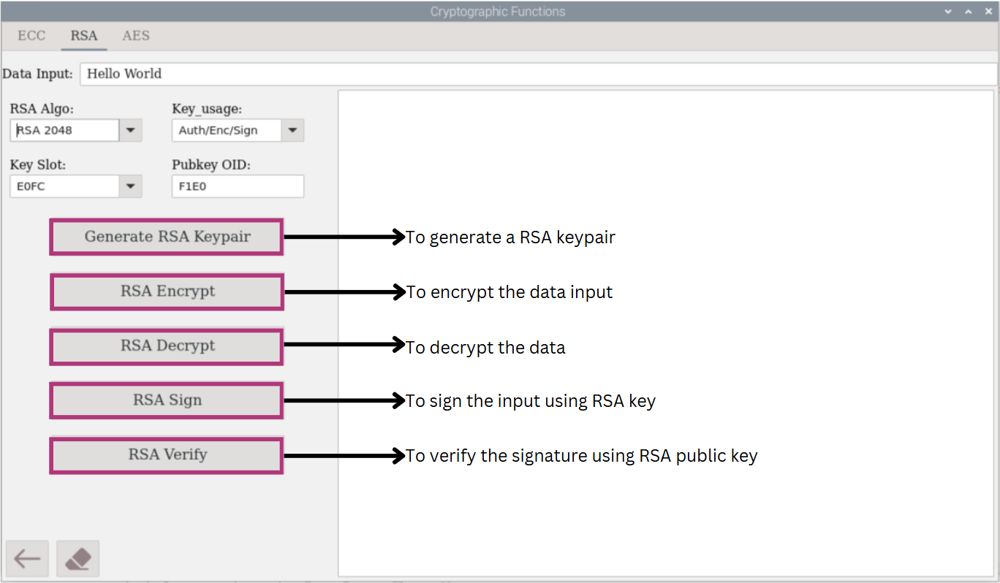

[^Figure 9]: RSA cryptographic functions described

### RSA Key Generation

Generates OPTIGA™ Trust M RSA key pair

RSA Algo is the RSA Key algorithm to be used to generate the keypair. Key slot is the OID that will be used to store the private key after key generation. 

RSA Algo : *RSA 1024, RSA 2048* . Key Slot : *0xE0FC, 0xE0FD*

To generate RSA keypair, select the RSA Algo, Key slot and Key_usage. Then select "Generate RSA keypair" . In this example RSA Algo: *RSA 1024*, key slot: *0xE0FC* and key_usage:Auth/Enc/Sign are used.The public Key will be stored into corresponding OID which has been displayed in the GUI. 

```shell
Generating Trust M RSA key pair...
========================================================
Generating Key to 0xE0FC
Output File Name : rsa_e0fc_pub_1024.pem 
Generating RSA Key ........
OPTIGA execution time: 3.2287 sec.
Pubkey :
	30 81 9F 30 0D 06 09 2A 86 48 86 F7 0D 01 01 01 
	05 00 03 81 8D 00 30 81 89 02 81 81 00 99 E1 E0 
	70 1C 12 F4 74 A7 B7 7C 5E DE 63 62 D8 E1 29 64 
	......
Write Success to OID: 0xF1E0.
========================================================
'trustm_rsa_keygen -g 0xE0FC -t 0x13 -k 0x41 -o rsa_e0fc_pub_1024.pem -s executed
++++++++++++++++++++++++++++++++++++++++++++

```

Expected Output (Partial): RSA key generated successfully in key slot:*0xE0FC* (RSA 1024)

### RSA Encryption

Encryption using OPTIGA™ Trust M RSA Public key

To Encrypt the input data using RSA, enter the data in "Data Input". Then select "RSA Encrypt " to encrypt the message. 

```shell
Storing data in datain.txt...
datain.txt generated

++++++++++++++++++++++++++++++++++++++++++++
Encrypting with RSA public key ...


========================================================
Pubkey file      : rsa_e0fc_pub_1024.pem 
Output File Name : datain.enc 
Input File Name  : datain.txt 
Input data : 
	48 65 6C 6C 6F 20 57 6F 72 6C 64 0A 
OPTIGA execution time: 0.1614 sec.
Success
========================================================
'trustm_rsa_enc -p rsa_e0fc_pub_1024.pem -o datain.enc -i datain.txt executed
++++++++++++++++++++++++++++++++++++++++++++
```

Expected Output: Encrypted using RSA public key

###      RSA Decryption

Decryption using OPTIGA™ Trust M RSA Private key

To Decrypt the message, Select "RSA Decrypt"  to decrypt and display the decrypted message.

```shell
Decrypting with RSA private key...

========================================================
OID Key          : 0xE0FC 
Output File Name : datain.dec 
Input File Name  : datain.enc 
Input data : 
	08 2E 29 1A 74 D7 66 A4 40 49 BB 4D 11 7A E9 5A 
	B8 A7 1F 10 69 0F 83 D9 4B B3 82 A3 94 B7 86 1D 
	4D F5 72 55 3A 33 3B E8 EC 93 B8 65 FD B5 B9 16 
	F4 27 BC 37 FD CA D2 93 21 1F E7 C2 F8 A9 D1 CC 
	F8 9E 7D 2C 84 0D 52 A0 06 E6 E3 A4 35 EA 87 27 
	19 1B 34 DE 83 DA 42 3E 24 23 20 06 12 22 4A 97 
	CA 75 12 1A 9A 2E F2 42 BF F8 4C 4F 05 78 4B 95 
	B3 E1 27 48 92 1C 4D D1 4D BA C5 7F 15 86 20 64 
	
OPTIGA execution time: 0.2603 sec.
Success
========================================================
'trustm_rsa_dec -k 0xE0FC -o datain.dec -i datain.enc executed
++++++++++++++++++++++++++++++++++++++++++++
Reading decrypted data...
Hello World
'cat datain.dec' executed
++++++++++++++++++++++++++++++++++++++++++++
```

Expected Output: Decrypted using private key

### RSA Sign

Hashes and signs the input using the OPTIGA™ Trust M RSA keypair

To Sign the input data using RSA , select RSA Algo and key slot to sign. In this Example, "RSA Algo: 1024" and "Key slot: E0FC" are used. 

```shell
Storing data in datain.txt...

datain.txt generated

========================================================
OID Key          : 0xE0FC
Output File Name : testsignature_1024.bin 
Input File Name  : datain.txt 
Hash Success : SHA256
	D2 A8 4F 4B 8B 65 09 37 EC 8F 73 CD 8B E2 C7 4A 
	DD 5A 91 1B A6 4D F2 74 58 ED 82 29 DA 80 4A 26 
	
filesize: 12
OPTIGA execution time: 0.1902 sec.
Success
========================================================
'trustm_rsa_dec -k 0xE0FC -o testsignature_1024.bin -i datain.txt executed
++++++++++++++++++++++++++++++++++++++++++++
00000000: 3dea 0257 606a 680d 2b9b 16da 5998 be20 =..W`jh.+...Y.. 
00000010: edc8 803d 214b 6d3b be3e 4a24 b88d 29cd ...=!Km;.>J$..).
00000020: cb9d 5a12 7fae 6e1e d435 82f3 51dc 2555 ..Z...n..5..Q.%U
......
python3 emulator.py testsignature_1024.bin executed 
++++++++++++++++++++++++++++++++++++++++++++
```

Expected Output (Partial): Data input signed using RSA key

### RSA Verify

Verifies the signature using the public key generated.

To verify using RSA, select the RSA Algo and key slot to verify.  In this Example, "RSA Algo: 1024" and "Key slot: E0FC" are used.

```shell
========================================================
App DataStrucObj type 2     [0xF1E0] 
OPTIGA execution time: 0.1936 sec.
[Size 0162] : 
	30 81 9F 30 0D 06 09 2A 86 48 86 F7 0D 01 01 01 
	05 00 03 81 8D 00 30 81 89 02 81 81 00 99 E1 E0 
	......
Output to rsa_e0fc_pub_1024.bin
========================================================
'openssl rsa -pubin -inform DER -in test_e0fc_pub_1024.bin -outform PEM -out rsa_e0fc_pub_1024.pem' executed 

========================================================
Pubkey file         : rsa_e0fc_pub_1024.pem
Input File Name     : datain.txt 
Signature File Name : testsignature_1024.bin 
Hash Digest : 
	D2 A8 4F 4B 8B 65 09 37 EC 8F 73 CD 8B E2 C7 4A 
	DD 5A 91 1B A6 4D F2 74 58 ED 82 29 DA 80 4A 26 
	
Signature : 
	3D EA 02 57 60 6A 68 0D 2B 9B 16 DA 59 98 BE 20 
	ED C8 80 3D 21 4B 6D 3B BE 3E 4A 24 B8 8D 29 CD 
	......
	
OPTIGA execution time: 0.1124 sec.
Verify Success.
========================================================
'trustm_rsa_verify -i datain.txt -s testsignature_1024.bin -p rsa_e0fc_pub_1024.pem -H executed
++++++++++++++++++++++++++++++++++++++++++++
```

Expected Output (Partial): Signature verified successfuly

## AES Cryptographic Function

This section shows the use OPTIGA Trust M Symmetric Key Gen Functions as well the AES Encryption and Decryption for the Symmetric key.  

Open the "Cryptographic Functions" Tab

Select 'AES'

### Functions

AES Functions Description

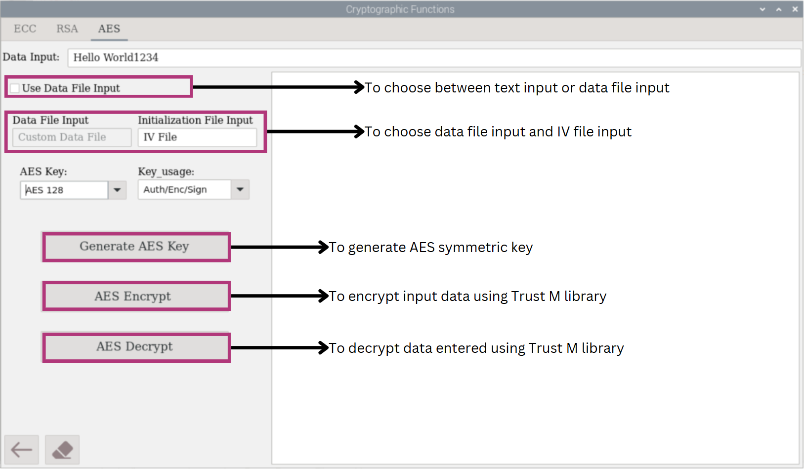

[^Figure 10]: AES cryptographic functions described

### AES Key Generation

Generates OPTIGA™ Trust M AES symmetric key.

AES Key is to select the AES key type to be generated.  Supported AES Key:  *AES 128, AES 192, AES 256*  Key_usage is  to select the usage for the generated AES key.

To generate AES symmetric key, Select the AES Key and Key_usage. In this Example, "AES Key: AES 256" and "Key_usage: Auth/Enc/Sign" are used. Then select "Generate AES key".

```shell
Generating Trust M AES 256 key... 
Set Change to ALW to enable AES Key Gen(Only executable when LcsO<op)
========================================================
Symmetric Key [0xe200] 

	20 03 D0 01 00 
	Change:ALW, 
OPTIGA execution time: 0.1192 sec.
Write Success.
========================================================

./bin/trustm_metadata -w 0xe200 -Ca 
+++++++++++++++++++++++++++++++++++++++++++++++++++++++++++++++++ 

========================================================
OPTIGA execution time: 0.1534 sec.
Successfully Generated Symmetric Key in 0xE200 
========================================================

./bin/trustm_symmetric_keygen -t 0x13 -k 0x83 executed 
+++++++++++++++++++++++++++++++++++++++++++++++++++++++++++++++++ 
```

Expected Output: AES 256 symmetric key generated 

### AES Encryption

Encryption of the input data using AES Key generated by OPTIGA™ Trust M

To Encrypt the input text data using AES key, first **de-select** the "Use Data File Input" checkbox, then enter the data in "Data Input". Click "IV File" text box to select desired Initialization file. Then select "AES Encrypt " to encrypt the message. The AES CBC mode is using here for AES Encryption and Decryption.

In this Example, "AES Key: AES 256", "Key_usage: Auth/Enc/Sign", "Initialization File Input: iv_aes256.bin" and "Data Input: Hello World1234" are used. 

```shell
Encrypting AES 256 key...

========================================================
mode             : 0x0009 
Output File Name : aes256.enc 
Input File Name  : mydata.txt 
Input data : 
	48 65 6C 6C 6F 20 57 6F 72 6C 64 31 32 33 34 0A 
	
......
Success
========================================================

/trustm_symmetric_enc -m 0x09 -v /home/pi/optiga-trust-m-explorer/Python_TrustM_GUI/linux-optiga-trust-m/scripts/misc/iv_aes256.bin -i mydata.txt -o aes256.enc is executed

++++++++++++++++++++++++++++++++++++++++++++
```

 Expected Output (Partial): Text data input encrypted using AES key

To Encrypt the input custom data using AES key, first **select** the "Use Data File Input" checkbox, then click "Custom Data File" textbox to select data file to encrypt. Click "IV File" text box to select desired Initialization file. Then select "AES Encrypt " to encrypt the data file.

In this Example, "AES Key: AES 256", "Key_usage: Auth/Enc/Sign", "Initialization File Input: iv_aes256.bin" and Data File Input: mydata.txt" are used. `mydata.txt` contains "mydata123456789".


```shell
Encrypting AES 256 key...

========================================================
mode             : 0x0009 
Output File Name : aes256.enc 
Input File Name  : /home/pi/optiga-trust-m-explorer/Python_TrustM_GUI/linux-optiga-trust-m/scripts/misc/mydata.txt 
Input data : 
	6D 79 64 61 74 61 31 32 33 34 35 36 37 38 39 0A 
......
Success
========================================================

/trustm_symmetric_enc -m 0x09 -v /home/pi/optiga-trust-m-explorer/Python_TrustM_GUI/linux-optiga-trust-m/scripts/misc/iv_aes256.bin -i /home/pi/optiga-trust-m-explorer/Python_TrustM_GUI/linux-optiga-trust-m/scripts/misc/mydata.txt -o  aes256.enc is executed

++++++++++++++++++++++++++++++++++++++++++++
```

Expected Output (Partial): Custom data input encrypted using AES CBC Mode

### AES Decryption

Decryption of the input data using AES key generated by OPTIGA™ Trust M 

To Decrypt the message, Select "AES Decrypt" to decrypt and display the decrypted message. The decrypted message is also available at `working_space/mydata.txt.dec`

```shell
Decrypting with AES 256 Symmetric key...

========================================================
mode             : 0x0009 
Output File Name : mydata.txt.dec 
Input File Name  : aes256.enc 
Input data : 
	77 57 81 E5 AC E4 06 A6 F4 91 7C C0 11 06 95 18 
	09 25 2B C0 62 5F C7 D5 78 DD A3 C7 82 28 9B 88 
	
IV File Name  : /home/pi/optiga-trust-m-explorer/Python_TrustM_GUI/linux-optiga-trust-m/scripts/misc/iv_aes256.bin 
Initialized value : 
	69 6E 69 74 69 61 6C 69 7A 65 64 76 32 35 36 0A 
	
Number of fragments: 2
Total data length: 32
OPTIGA execution time: 0.1795 sec.
Success
========================================================

/trustm_symmetric_dec -m 0x09 -v/home/pi/optiga-trust-m-explorer/Python_TrustM_GUI/linux-optiga-trust-m/scripts/misc/iv_aes256.bin -i aes256.enc -o mydata.txt.dec  is executed

+++++++++++++++++++++++++++++++++++++++++++++++++++++++++++++

Reading decrypted data...

mydata123456789

'cat mydata.txt.dec' executed

++++++++++++++++++++++++++++++++++++++++++++++++++++++++++++++
```

Expected Output: Data Input decrypted using AES CBC Mode

# OpenSSL Provider

This section shows you the OpenSSL-Provider functions of the OPTIGA™ Trust M . The OpenSSL-Provider can be used to create RSA(Client/Server) and can also be used for random number generation.

## ECC (Client/Server)

The ECC(CLient/ Server) is a demonstration to show the use of the Trust M Provider for secure communications between client and server

Select "ECC (Client/Server)"

## ECC (Client/Server) Function Description

ECC (Client/Server) Functions described

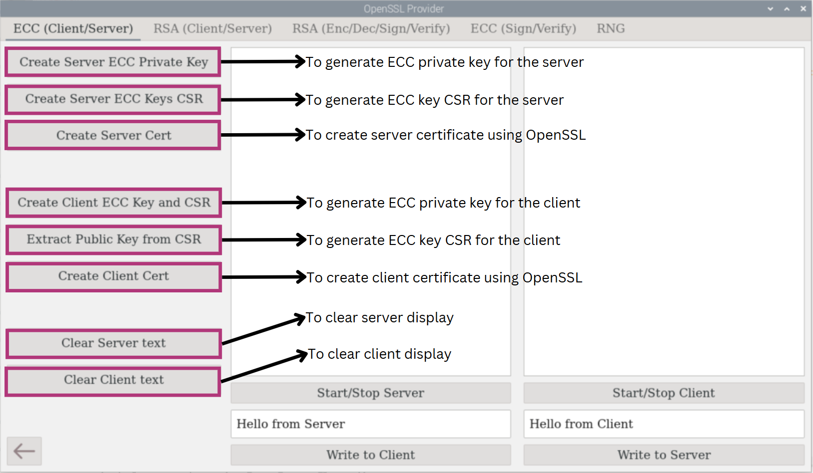

[^Figure 11]: OpenSSL-Provider ECC (Client/Server) Function Description part 1

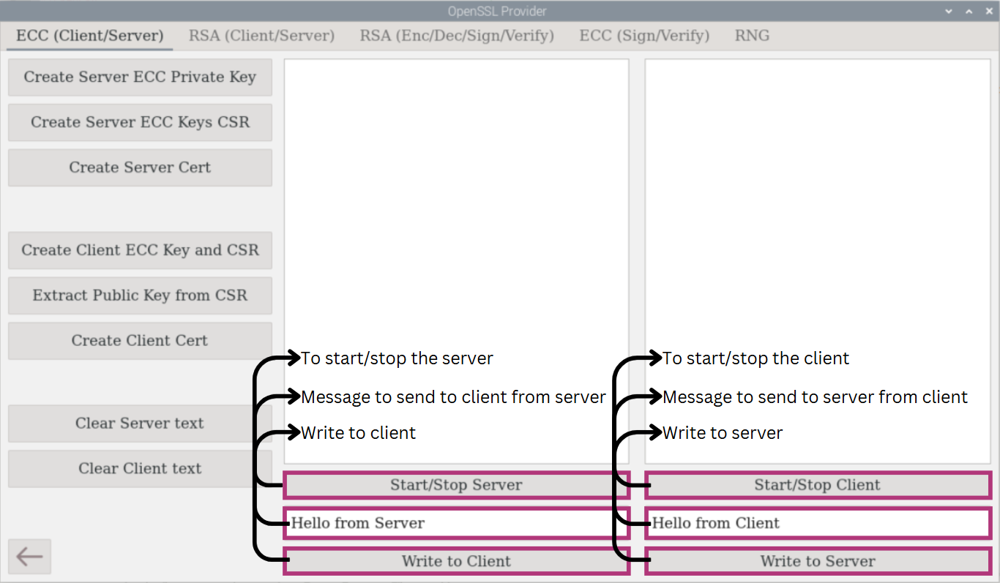

[^Figure 12]: OpenSSL-Provider ECC (Client/Server) Function Description part 2

### ECC Create Server Certificate

Generate private key and CSR for server.

Select "Create Server Private Key and CSR"

```shell
Creating Server ECC Private Key... 
'openssl ecparam -out server1_privkey.pem -name prime256v1 -genkey' executed 
+++++++++++++++++++++++++++++++++++++++++++
```

Expected Output: OpenSSL-Provider ECC (Client/Server) Create Private Key (For Server)


```shell
Creating Server ECC Keys CSR... 
'openssl req -new -key server1_privkey.pem -subj /CN=Server1/O=Infineon/C=SG -out server1.csr' executed 
+++++++++++++++++++++++++++++++++++++++++++
```

Expected Output: OpenSSL-Provider ECC (Client/Server) Create Certificate Signing Request (For Server)

Generate Server Certificate using Certificate Authority

Select "Create Server Cert"

```shell
Creating Server Certificate by using CA...
Certificate request self-signature ok
subject=CN = Server1, O = Infineon, C = SG
+++++++++++++++++++++++++++++++++++++++++++
```

Expected Output: OpenSSL-Provider ECC (Client/Server) Create Server Cert (For Server)

### ECC Create Client Certificate

Generate ECC Key and CSR for client.

Select "Create Client ECC Key and CSR"

```shell
Creating new ECC 256 key length with Auth/Enc/Sign usage and creating a certificate request...
Input OID E0F3
Saving public EC key to OID : 0xF1D3 ...
'openssl req -provider trustm_provider -key 0xe0f3:*:NEW:0x03:0x13 -new -out client1_e0f3.csr -subj /CN=TrustM/O=Infineon/C=SG' executed 
Certificate Request:
    Data:
        Version: 1 (0x0)
        Subject: CN = TrustM, O = Infineon, C = SG
        Subject Public Key Info:
        .......
-----BEGIN CERTIFICATE REQUEST-----
MIHuMIGTAgEAMDExDzANBgNVBAMMBlRydXN0TTERMA8GA1UECgwISW5maW5lb24x
......
-----END CERTIFICATE REQUEST-----
'openssl req -in client1_e0f3.csr -text' executed 
+++++++++++++++++++++++++++++++++++++++++++

```

Expected Output (Partial): OpenSSL-Provider ECC (Client/Server) Create Certificate Signing Request (For Client)

```shell
Extracting Public Key from CSR...
Public key extracted successfully.
'openssl req -in client1_e0f3.csr -pubkey -noout -out client1_e0f3.pub' executed 
'openssl pkey -in client1_e0f3.pub -pubin -text' executed 
+++++++++++++++++++++++++++++++++++++++++++
```

Expected Output (Partial): OpenSSL-Provider ECC (Client/Server) Extract Public Key (For Client)

Generate Client Certificate using Certificate Authority

Select "Create Client Cert"

```shell
Creating Client Certificate by using CA...
Certificate request self-signature ok
subject=CN = TrustM, O = Infineon, C = SG
+++++++++++++++++++++++++++++++++++++++++++
```

Expected Output: OpenSSL-Provider ECC (Client/Server) Create Client Certificate (For Client)

### ECC Start an OpenSSL Server

Starting an OpenSSL server

Start an OpenSSL S_Server instance by selecting "Start/Stop Server"  

```shell
openssl s_server -cert server1.crt -key server1_privkey.pem -accept 5000 -verify_return_error -Verify 1 -CAfile /home/pi/optiga-trust-m-explorer/Python_TrustM_GUI/linux-optiga-trust-m/scripts/certificates/OPTIGA_Trust_M_Infineon_Test_CA.pem

verify depth is 1, must return a certificate
Using default temp DH parameters
ACCEPT
```

Expected Output: OpenSSL-Provider ECC (Client/Server) Start/Stop Server

### ECC Start an OpenSSL Client

Start an OpenSSL Client

Start an OpenSSL Client and connect  with OpenSSL Server by selecting "Start/Stop Client"


```shell
openssl s_client -servername Server1 -connect localhost:5000 -client_sigalgs ECDSA+SHA256 -provider trustm_provider -provider default -cert client1_e0f3.crt -key 0xe0f3:^ -verify 1 -CAfile /home/pi/optiga-trust-m-explorer/Python_TrustM_GUI/linux-optiga-trust-m/scripts/certificates/OPTIGA_Trust_M_Infineon_Test_CA.pem

verify depth is 1
depth=1 C = DE, O = Infineon Technologies AG, OU = OPTIGA(TM), CN = Infineon OPTIGA(TM) Trust M Test CA 000
verify return:1
depth=0 CN = Server1, O = Infineon, C = SG
verify return:1
Input OID E0F3
CONNECTED(00000003)
---
Certificate chain
 0 s:CN = Server1, O = Infineon, C = SG
   i:C = DE, O = Infineon Technologies AG, OU = OPTIGA(TM), CN = Infineon OPTIGA(TM) Trust M Test CA 000
   a:PKEY: id-ecPublicKey, 256 (bit); sigalg: ecdsa-with-SHA256
   v:NotBefore: Jun 26 12:11:05 2025 GMT; NotAfter: Jun 26 12:11:05 2026 GMT
......
```

Expected Output (Partial): OpenSSL-Provider Client Text When ECC (Client/Server) Start/Stop Client

```shell
depth=1 C = DE, O = Infineon Technologies AG, OU = OPTIGA(TM), CN = Infineon OPTIGA(TM) Trust M Test CA 000
verify return:1
depth=0 CN = TrustM, O = Infineon, C = SG
verify return:1
-----BEGIN SSL SESSION PARAMETERS-----
MIICpQIBAQICAwQEAhMCBCAACPwm19CwRioojZ7AzhAvB8eKZ39LGR+hhF0K9n3K
YwQwESq9yk2KLKNYXWBqlDNmPJI68LwycBmM1qvPH/umSn4L7jnHeGrxWxfl5Zjv
hYV6oQYCBGhdObOiBAICHCCjggIeMIICGjCCAb+gAwIBAgIUFPXCLnaH62/ETU7y
rlPof9uaReEwCgYIKoZIzj0EAwIwdzELMAkGA1UEBhMCREUxITAfBgNVBAoMGElu
......
```

Expected Output (Partial): OpenSSL-Provider Server Text When ECC (Client/Server) Start/Stop Client

### ECC Secure data exchange between Server and Client

Messages can be sent from Server to Client as well as Client to Server by entering input in the boxes below and selecting "Write to Client" or "Write to Server".  The message "Hello from Server" and "Hello from Client" has been successfully sent

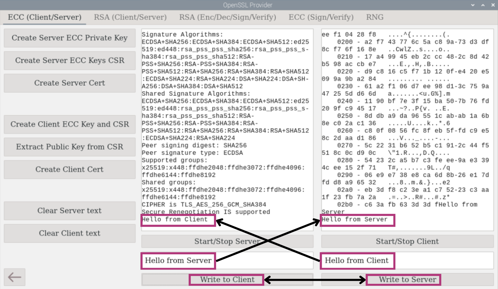

[^Figure 13]: OpenSSL-Provider ECC (Client/Server) Data Exchange


## RSA (Client/Server)

The RSA(Client/Server) is a demonstration to show the use of the Trust M for secure communications between client and server.

Select "RSA (Client/Server)"

## RSA (Client/Server) Function Description

RSA (Client/Server) Functions described

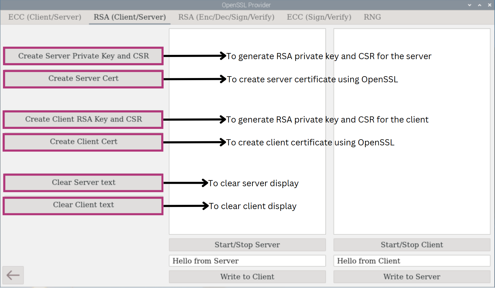

[^Figure 14]: OpenSSL-Provider RSA (Client/Server) Function Description part 1

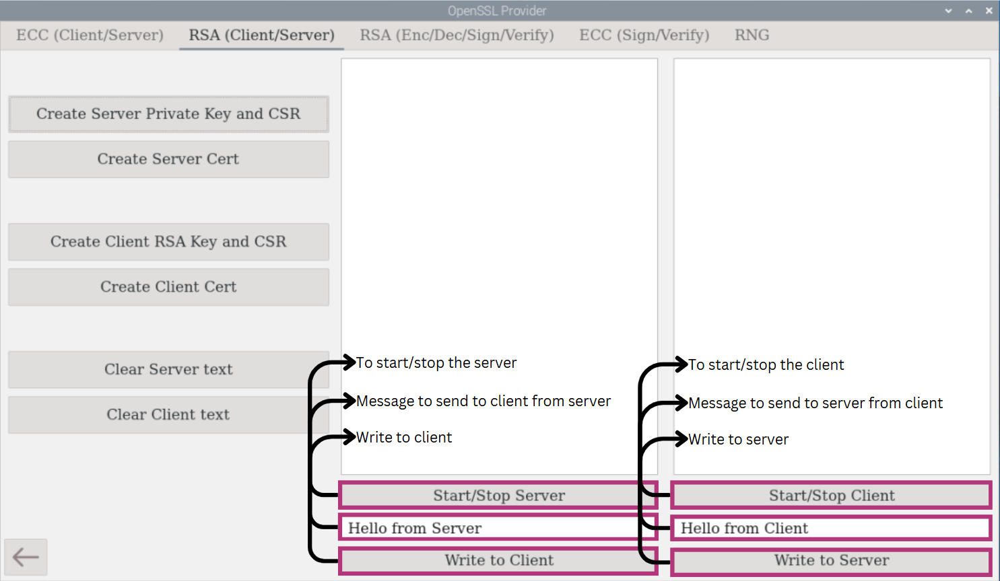

[^Figure 15]: OpenSSL-Provider RSA (Client/Server) Function Description part 2

### RSA Create Server Certificate

Generate private key and CSR for server.

Select "Create Server Private Key and CSR"

```shell
Creating Server RSA Private Key and CSR 
.............+....+...+++++++++++++++++++++++++++++++++++++++++++++++++++++++++++++++++*.+.+........+......+..........+..+++++++++++++++++++++++++++++++++++++++++++++
......
-----
'openssl req -new -nodes -subj /CN=Server2/O=Infineon/C=SG -out server2.csr' executed 
writing RSA key
'openssl rsa -in privkey.pem -out server2_privkey.pem' executed 
+++++++++++++++++++++++++++++++++++++++++++
```

Expected Output (Partial): OpenSSL-Provider RSA (Client/Server) Create Private Key and Certificate Signing Request (For Server)

Generate Server Certificate using Certificate Authority

 Select "Create Server Cert"

```shell
Creating Server Certificate by using CA...
Certificate request self-signature ok
subject=CN = Server2, O = Infineon, C = SG
+++++++++++++++++++++++++++++++++++++++++++
```

Expected Output: OpenSSL-Provider RSA (Client/Server) Create Server Cert (For Server)

### RSA Create Client Certificate

Generate RSA Key and CSR for client.

Select "Create Client RSA Key and CSR"

```shell
Creating new RSA 2048 key length with Auth/Enc/Sign usage and creating a certificate request...
Input OID E0FC
Generating RSA keypair using TrustM....
Writing public key to OID 0xF1E0
'openssl req -provider trustm_provider -key 0xe0fc:*:NEW:0x42:0x13 -new -out client2_rsa.csr -subj /CN=TrustM/O=Infineon/C=SG' executed 
+++++++++++++++++++++++++++++++++++++++++++
```

Expected Output: OpenSSL-Provider RSA (Client/Server) Create Client RSA key and CSR (For Client)

Generate Client Certificate using Certificate Authority

Select "Create Client Cert"

```shell
Creating Client Certificate by using CA...
Certificate request self-signature ok
subject=CN = TrustM, O = Infineon, C = SG
+++++++++++++++++++++++++++++++++++++++++++
```

Expected Output: OpenSSL-Provider RSA (Client/Server) Create Client Certificate (For Client)

### RSA Start an OpenSSL Server

Starting an OpenSSL server

Start an OpenSSL S_Server instance by selecting "Start/Stop Server"  

```shell
openssl s_server -tls1_2 -cert server2.crt -key server2_privkey.pem -accept 5001 -verify_return_error -Verify 1 -CAfile /home/pi/optiga-trust-m-explorer/Python_TrustM_GUI/linux-optiga-trust-m/scripts/certificates/OPTIGA_Trust_M_Infineon_Test_CA.pem -sigalgs RSA+SHA256

verify depth is 1, must return a certificate
Using default temp DH parameters
ACCEPT
```

Expected Output: OpenSSL-Provider RSA (Client/Server) Start Server

### RSA Start an OpenSSL Client

Start an OpenSSL Client

Start an OpenSSL Client and connect  with OpenSSL Server by selecting "Start/Stop Client"

```shell
openssl s_client -tls1_2 -servername Server2 -connect localhost:5001 -client_sigalgs RSA+SHA256 -provider trustm_provider -provider default -cert client2_rsa.crt -key 0xe0fc:^ -CAfile /home/pi/optiga-trust-m-explorer/Python_TrustM_GUI/linux-optiga-trust-m/scripts/certificates/OPTIGA_Trust_M_Infineon_Test_CA.pem -verify 1

verify depth is 1
depth=1 C = DE, O = Infineon Technologies AG, OU = OPTIGA(TM), CN = Infineon OPTIGA(TM) Trust M Test CA 000
verify return:1
depth=0 CN = Server2, O = Infineon, C = SG
verify return:1
Input OID E0FC
CONNECTED(00000003)
siglen : 256
---
Certificate chain
 0 s:CN = Server2, O = Infineon, C = SG
   i:C = DE, O = Infineon Technologies AG, OU = OPTIGA(TM), CN = Infineon OPTIGA(TM) Trust M Test CA 000
   a:PKEY: rsaEncryption, 2048 (bit); sigalg: ecdsa-with-SHA256
   v:NotBefore: Jun 26 12:43:21 2025 GMT; NotAfter: Jun 26 12:43:21 2026 GMT
......
```

Expected Output (Partial): OpenSSL-Provider Client Text When RSA (Client/Server) Start/Stop Client

```shell
depth=1 C = DE, O = Infineon Technologies AG, OU = OPTIGA(TM), CN = Infineon OPTIGA(TM) Trust M Test CA 000
verify return:1
depth=0 CN = TrustM, O = Infineon, C = SG
verify return:1
-----BEGIN SSL SESSION PARAMETERS-----
MIIDSgIBAQICAwMEAsAwBAAEMBcGu5A+GcPj2Xn2+COk3L1Vo2V4DmlIQM8/geW2
7HHB4vRnsBafSupgQHolDX9gJKEGAgRoXUHVogQCAhwgo4IC5zCCAuMwggKKoAMC
.......
```

Expected Output (Partial): OpenSSL-Provider Server Text When ECC (Client/Server) Start/Stop Client


### RSA Secure data exchange between Server and Client

Messages can be sent from Server to Client as well as Client to Server by entering input in the boxes below and selecting "Write to Client" or "Write to Server".  The message "Hello from Server" and "Hello from Client" has been successfully sent as shown in Figure 16

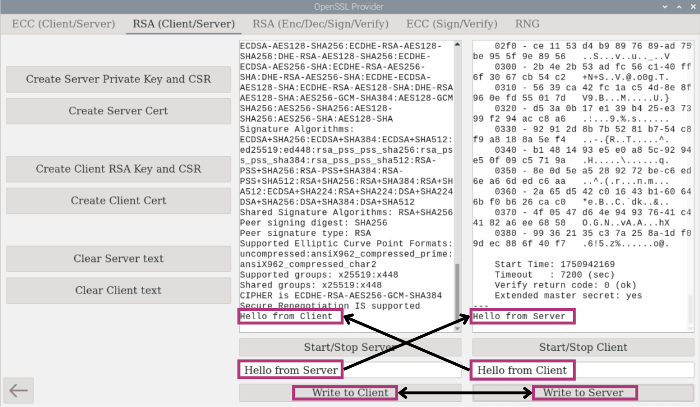

[^ Figure 16]: OpenSSL-Provider RSA (Client/Server) Data Exchange


## Random Number Generator

This section shows to use OpenSSL libraries to generate random number based on Encoding type hex or base64  with indicated number of bytes to be generated.

Open the OpenSSL-Provider In Main 

Select "RNG".

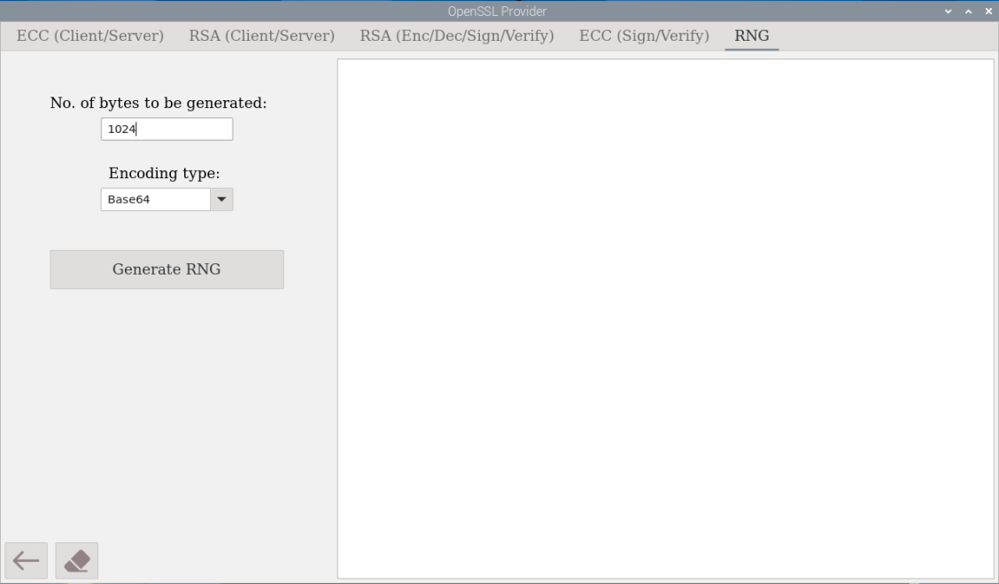

[^Figure 17]: OpenSSL RNG Menu Screen

To change the bytes generated, enter the input in "No. of bytes to be generated". 

To generate random number, enter the "No. of bytes to be generated" and select the encoding type. Then select "Generate RNG" to generate random number. 

In this example, the numbers generated are 1024 bytes in base64 encoding.

```shell
Generating Random Number in Base64 encoding....

=========================================================================
z2c6o2TomTqgjpehNSyAXnFlrD8cRiQAftCsAsS8OTfTKhUdCxus7Q15At/D+Cqj
sB13i1D6vVbr5qQrABT9PUgerbwBNLoUoZUtrdLxwImW1XoErMqgLFQ2saNoLNI7
DxYVTqmsukyFrymYCj3wE6uEHr6Tmwi4aZuymyi1qppN91VPXSzaHpBzajWdezI0
.......

=========================================================================
'openssl rand -provider -trustm_provider -base64 1024 executed'
+++++++++++++++++++++++++++++++++++++++++++++++++++++++++++++++++++++++++
```

Expected Output (Partial): RNG generated 


# Protected Update

This section shows the use of the  OPTIGA™ Trust M Integrity and Confidentially Protected Update for metadata of target OID  and ECC/AES/RSA Key of target key OID by using the Trust Anchor and Secret installed in the OPTIGA™ Trust M.

# Metadata Protected Update

This section shows the use of the  OPTIGA™ Trust M Integrity and Confidentially Protected Update for metadata of target OID by using the Trust Anchor and Secret installed in the OPTIGA™ Trust M.

1. Select "Protected Update"
2. Overview of the "Metadata Update" tab.

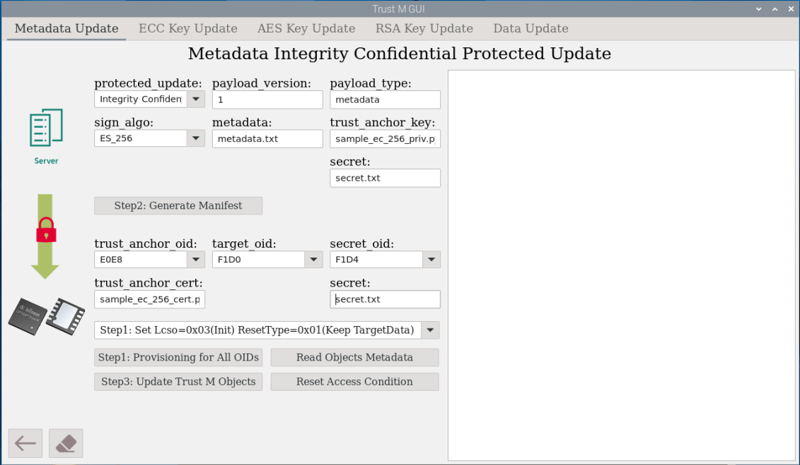

[^Figure 18]: Overview of "Metadata Update" Screen

## Metadata Protected Update Functions

Description of the Steps to do a successful Protected Update of Trust M objects

### Step 1 (Provisioning for All OIDs)

For Step 1, There are two options, Wipe target data and Keep Target data.  For Wipe target data, the target OID Lcs0 will be set to Initialization mode (0x03) and the reset type will be set to 0x11 (SETCRE/FLUSH). For Keep target data, the target OID Lcs0 will be set to Initialization mode (0x03) and the reset type will be set to 0x01 (SETCRE).

For both options, the "Trust anchor OID" is used to store the trust anchor and the data object type is set to Trust Anchor. The Protected Update Secret is written to the data object of "Secret OID " and the Data type will be set to UPDATESEC . The metadata of target OID will be set according during Provisioning. 

Trust Anchor OID options: *0xE0E8 - 0xE0E9*, *0xE0EF* , Target OID options: *0xE0E1 - 0xE0E3, 0xF1D0 - 0xF1DB,0xE0F1 - 0xE0F3,0xE0FC - 0xE0FD, 0xF1E0-0xF1E1*

Secret OID options: *0xF1D0, 0xF1D4 - 0xF1DB*

In this example we will Provision for all OIDs (Wipe TargetData). Select "Step1: Set Lcso=0x03(Init) ResetType=0x01(Keep TargetData)" and also the OIDs including "Trust anchor OID: E0E8", "Target OID: F1D5" and "Secret OID: F1D4".

Choose the trust_anchor_cert which will be stored inside the "Trust anchor OID"  and also the secret file which will be stored inside the "Secret OID"

To Provision,  Select "Step1: Provisioning for All OIDs". 

```shell
Provisioning Data Objects ... 
Provisioning for initial Trust Anchor OID... 
========================================================
OPTIGA execution time: 0.2486 sec.
Success!!!
========================================================
'trustm_cert -w 0x0xE0E8 -i /home/pi/optiga-trust-m-explorer/Python_TrustM_GUI/linux-optiga-trust-m/scripts/certificates/sample_ec_256_cert.pem' executed 
......
++++++++++++++++++++++++++++++++++++++++++++
Change Target OID Lcs0 to Initialization mode... 

========================================================
App DataStrucObj type 3     [0xF1D5] 

	20 03 C0 01 03 
	LcsO:0x03, 
OPTIGA execution time: 0.1204 sec.
Write Success.
========================================================
'trustm_metadata -w 0xF1D5 -I' executed 
++++++++++++++++++++++++++++++++++++++++++++
```

Expected Output (Partial): Provision Data Objects (for Keep TargetData)

After provisioning,  we can press "Read Objects Metadata" button to read out the the metadata for all the OIDs involved. In this example, the *MUD* for target OID should be *int-0xE0E8&&Conf-0xF1D4* after provisioning. 

```shell
Reading Objects Metadata... 
Reading out metadata for trust_anchor_oid... 

========================================================
Root CA Public Key Cert1    [0xE0E8] 
OPTIGA execution time: 0.1121 sec.
......

========================================================
App DataStrucObj type 3     [0xF1D5] 
OPTIGA execution time: 0.1048 sec.
[Size 0041] : 
	20 27 C0 01 03 C1 02 00 00 C4 01 8C C5 01 20 D0 
	03 E1 FC 07 D1 01 00 D3 01 00 D8 07 21 E0 E8 FD 
	20 F1 D4 E8 01 00 F0 01 01 
	LcsO:0x03, Version:0000, Max Size:140, Used Size:32, Change:LcsO<0x07, Read:ALW, Execute:ALW, MUD:Int-0xE0E8&&Conf-0xF1D4, Data Type:BSTR, Reset Type:SETCRE, 

========================================================
'trustm_metadata -r 0xF1D5' executed 
++++++++++++++++++++++++++++++++++++++++++++
```

Expected Output (Partial): Read objects Metadata after provisioning

### Step 2 (Generate the Manifest and Fragment)

> [!NOTE]
> The number for payload version must be larger than the current version number.

Generate the manifest and fragment for the metadata Protected Update.

To generate the Manifest and fragment, Enter the "payload_version".  Choose the trust_anchor_privkey (Corresponding to trust_anchor_cert) and also the secret file (same with the secret stored inside  "Secret OID"). Select the "Step2 : Generate Manifest" button.  

In this example the "payload version" is set to 1 and metadata used is the metadata.txt file. 

The Manifest and Fragment Generation are based on all the input inside the red box. For more information for this part, refer to [protected update data set](https://github.com/Infineon/linux-optiga-trust-m/tree/development_v3/ex_protected_update_data_set) .

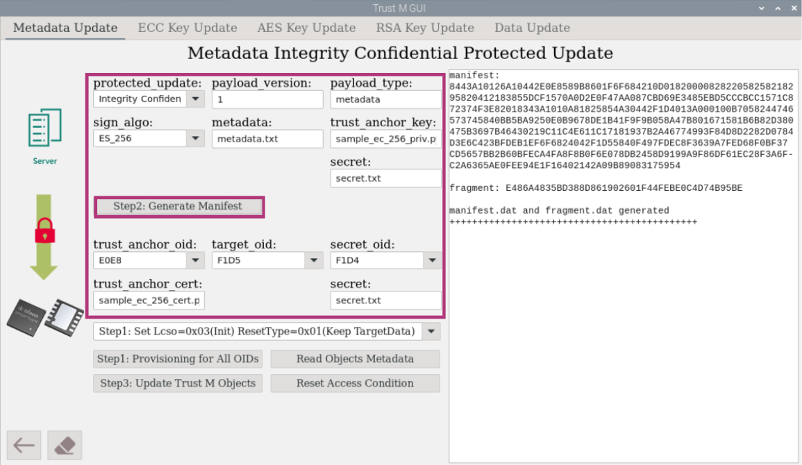

[^Figure 19]: Manifest and Fragment generated 

### Step 3 Protected Update for the metadata of Target OID

Protected Updates for the metadata of the target OID

To Update the metadata of the target OID, Select "Step3: Update Trust M Objects". 

```shell
Metadata protected update for Target OID... 

========================================================
OID            : 0xF1D5
Manifest File Name : manifest.dat 
Manifest : 
	84 43 A1 01 26 A1 04 42 E0 E8 58 9B 86 01 F6 F6 
	84 21 0D 01 82 00 00 82 82 20 58 25 82 18 29 58 
	......
Fragment File Name     : fragment.dat 
final fragment : 
	07 71 4F 45 20 73 96 30 9B 17 90 F0 A2 BB 8B 73 
	6F 7A BA EF 01 
OPTIGA execution time: 0.5813 sec.
Metadata protected update Successful.

========================================================
'trustm_protected_update -k 0xF1D5 -m manifest.dat -f fragment.dat' executed 
++++++++++++++++++++++++++++++++++++++++++++
``` 

Expected Output (Partial): Metadata protected update 

### Read Objects Metadata

Displays the metadata of the "Trust Anchor OID", "Target OID" and "Secret OID".

To read out metadata , select "Read Objects Metadata".

After successful metadata protected update, the Lcs0 of the target oid will be brought back to 0x01, and version will be increased to 0001 from 0000.

```shell
Reading Objects Metadata... 
Reading out metadata for trust_anchor_oid... 

========================================================
Root CA Public Key Cert1    [0xE0E8] 
OPTIGA execution time: 0.1341 sec.
......
Reading out metadata for target_oid... 

========================================================
App DataStrucObj type 3     [0xF1D5] 
OPTIGA execution time: 0.1334 sec.
[Size 0041] : 
	20 27 C0 01 01 C1 02 00 01 C4 01 8C C5 01 20 D0 
	03 E1 FC 07 D1 01 00 D3 01 00 D8 07 21 E0 E8 FD 
	20 F1 D4 E8 01 00 F0 01 01 
	LcsO:0x01, Version:0001, Max Size:140, Used Size:32, Change:LcsO<0x07, Read:ALW, Execute:ALW, MUD:Int-0xE0E8&&Conf-0xF1D4, Data Type:BSTR, Reset Type:SETCRE, 

========================================================
'trustm_metadata -r 0xF1D5' executed 
++++++++++++++++++++++++++++++++++++++++++++

```

Expected Output (Partial): Objects metadata displayed

### Reset Access Condition

Reset the Access Condition of the Target OID to *MUD:NEV* so that the Target OID is able to be back to initial MUD state for use in other features after a successful Protected Update and not locked. 

```shell
Resetting Metadata Update Description tag for Target OID... 
00000000: 2003 d801 ff                             ....
mud_reset.bin generated
Writing metadata for Target OID... 
'trustm_metadata -w 0xF1D5 -F mud_reset.bin' executed 
++++++++++++++++++++++++++++++++++++++++++++
Reading Objects Metadata... 
Reading out metadata for trust_anchor_oid... 

========================================================
Root CA Public Key Cert1    [0xE0E8] 
OPTIGA execution time: 0.1242 sec.
......
Reading out metadata for target_oid... 

========================================================
App DataStrucObj type 3     [0xF1D5] 
OPTIGA execution time: 0.1276 sec.
[Size 0035] : 
	20 21 C0 01 01 C1 02 00 01 C4 01 8C C5 01 20 D0 
	03 E1 FC 07 D1 01 00 D3 01 00 D8 01 FF E8 01 00 
	F0 01 01 
	LcsO:0x01, Version:0001, Max Size:140, Used Size:32, Change:LcsO<0x07, Read:ALW, Execute:ALW, MUD:NEV, Data Type:BSTR, Reset Type:SETCRE, 

========================================================
'trustm_metadata -r 0xF1D5' executed 
++++++++++++++++++++++++++++++++++++++++++++
```

Expected Output (Partial): Target OID access condition reset successfully

# ECC Key Protected Update

This section shows the use of the  OPTIGA™ Trust M Integrity and Confidentially Protected Update for ECC Key OIDs by using the Trust Anchor and Secret installed in the OPTIGA™ Trust M.

1. Select "ECC Key Update"
2. Overview of the "ECC Key Update" tab.

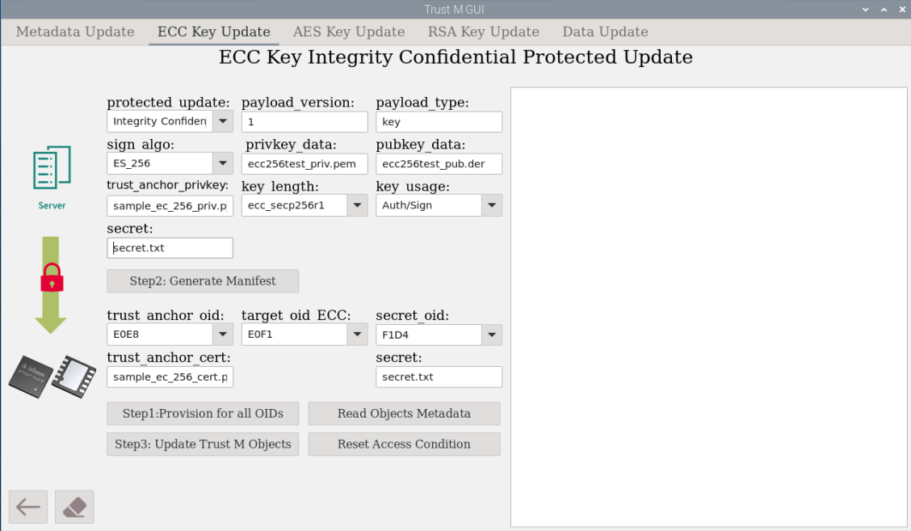

[^Figure 20]: ECC key Protected Update Screen

## ECC Key Protected Update Functions

Description of the Steps to do a successful Protected Update of OPTIGA™ Trust M ECC Key Data Objects.

### ECC: Step 1 (Provisioning for All OIDs)

For Step 1, the "Trust anchor OID" is used to store the trust anchor and the data object type is set to Trust Anchor. The Protected Update Secret is written to the data object of "Secret OID " and the Data type will be set to UPDATESEC . The metadata of target OID will be set according during Provisioning. 

Trust Anchor OID options: *0xE0E8 - 0XE0E9* , Target OID options: *0xE0F1 - 0xE0F3,*

Secret OID options: *0xF1D0, 0xF1D4 - 0xF1DB*

In this example we will Provision for all OIDs. Select the "Trust anchor OID: E0E8", "Target OID: E0F1", "Secret OID: F1D4". Then select the secret file to be used to store into the Secret OID and the Trust anchor Cert file to be used to store into trust anchor OID by clicking the respective textboxes. 


[^Figure 21]:Selection of Trust Anchor Certificate and Input Secret file

To Provision,  Select "Step1: Provisioning for All OIDs".  

In this example, after provisioning, the access condition *change* of target OID should be set to *Int-0xE0E8&&Conf-0xF1D4*.

```shell
Provisioning Data Objects ... 
Provisioning for initial Trust Anchor OID... 
========================================================
OPTIGA execution time: 0.3201 sec.
Success!!!
========================================================
'trustm_cert -w 0xE0E8 -i /home/pi/optiga-trust-m-explorer/Python_TrustM_GUI/linux-optiga-trust-m/scripts/certificates/sample_ec_256_cert.pem' executed 
++++++++++++++++++++++++++++++++++++++++++++
Provisioning for trust anchor metadata... 
'echo $TRUST_ANCHOR_META | xxd -r -p > trust_anchor_metadata.bin' executed 
......
Device EC Private Key x         [0xE0F1] 
OPTIGA execution time: 0.1081 sec.
[Size 0033] : 
	20 1F C0 01 01 C1 02 00 00 D0 07 21 E0 E8 FD 20 
	F1 D4 D1 01 00 D3 01 00 D8 01 FF E0 01 03 E1 01 
	11 
	LcsO:0x01, Version:0000, Change:Int-0xE0E8&&Conf-0xF1D4, Read:ALW, Execute:ALW, MUD:NEV, Algorithm:ECC256, Key Type:Auth/Sign, 

========================================================
'trustm_metadata --r 0xE0F1 executed 
++++++++++++++++++++++++++++++++++++++++++++
```

Expected Output (Partial): Provisioning for ECC key Protected Update

### ECC: Step 2 (Generate Manifest and Fragment)

Generate the manifest and fragment for the ECC key Protected Update.

To generate the Manifest and fragment, Enter the "payload version" and select the "privkey_data" and "pubkey_data" file you want to store into OPTIGA™ Trust M.

Choose the trust_anchor_privkey (Corresponding to trust_anchor_cert)and also the secret file (same with the secret stored inside  "Secret OID")

Select the "Step2 : Generate Manifest" button.  

In this example the "payload version" is set to 1 and the payload_type is key. The private key data used is the ecc256test_priv.pem file and the corresponding public key data is stored in the ecc256test_pub.der file. The private key used is sample_ec_256_priv.pem file and the secret used is secret.txt file.

The Manifest and Fragment Generation are based on all the input inside the box. For more information for this part, refer to  [protected update data set](https://github.com/Infineon/linux-optiga-trust-m/tree/development_v3/ex_protected_update_data_set) 

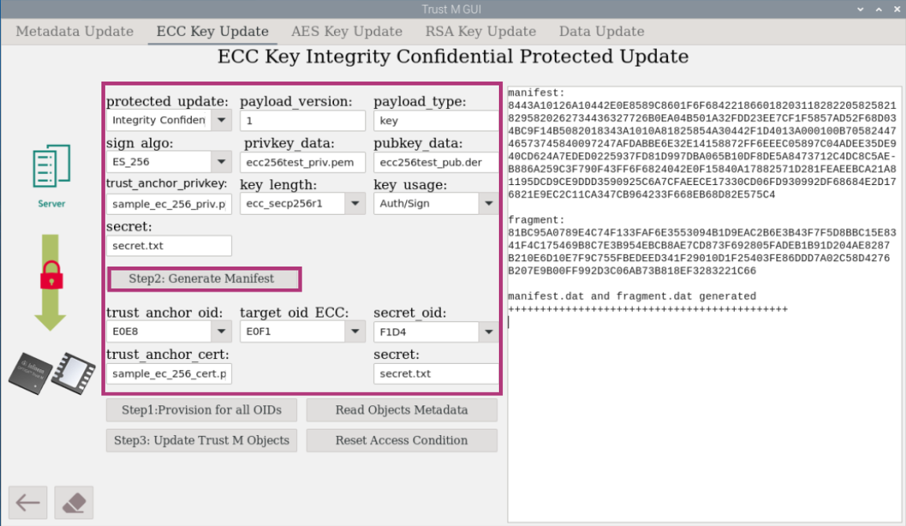

[^Figure 22]: ECC Key Manifest and Fragment generated 

### ECC: Step 3 Protected Update for the ECC Key 

Protected Updates the ECC key data into the target OID

To Update the ECC key into target OID, Select "Step3: Update Trust M Objects". 

```shell
ECC Key protected update for Target OID... 

========================================================
OID            : 0xE0F1
Manifest File Name : manifest.dat 
Manifest : 
	84 43 A1 01 26 A1 04 42 E0 E8 58 9C 86 01 F6 F6 
	84 22 18 66 01 82 03 11 82 82 20 58 25 82 18 29 
	......
Fragment File Name     : fragment.dat 
final fragment : 
	3B BE C3 B7 01 AB E9 BB 3A 98 1D 0D B7 B0 F8 02 
	40 1F EA D6 3D E3 01 0B 32 81 07 5C AE 6B CD E0 
	......
OPTIGA execution time: 0.6138 sec.
ECC Key protected update Successful.

========================================================
'trustm_protected_update_ecckey -k 0xE0F1 -m manifest.dat -f fragment.dat' executed 
'trustm_data -w 0xF1D1 -i ecc256test_pub.der -e' executed 
++++++++++++++++++++++++++++++++++++++++++++
```

Expected Output (Partial): ECC Key Protected Update successfully

### Read ECC key Objects Metadata 

Displays the metadata of the "Trust Anchor OID", "Target OID" and "Secret OID".

To read out metadata , select "Read Objects Metadata".

```shell
Reading Objects Metadata... 
Reading out metadata for trust_anchor_oid... 

========================================================
Root CA Public Key Cert1    [0xE0E8] 
OPTIGA execution time: 0.1090 sec.
......
Device EC Private Key x         [0xE0F1] 
OPTIGA execution time: 0.1095 sec.
[Size 0033] : 
	20 1F C0 01 01 C1 02 00 01 D0 07 21 E0 E8 FD 20 
	F1 D4 D1 01 00 D3 01 00 D8 01 FF E0 01 03 E1 01 
	11 
	LcsO:0x01, Version:0001, Change:Int-0xE0E8&&Conf-0xF1D4, Read:ALW, Execute:ALW, MUD:NEV, Algorithm:ECC256, Key Type:Auth/Sign, 

========================================================
'trustm_metadata -r 0xE0F1' executed 
++++++++++++++++++++++++++++++++++++++++++++
```

Expected Output (Partial): Read out object metadata

### Reset ECC Key Access Condition

Resets the Access Condition of the Target OID *Change* to *LCS <0x07* so that the Target OID will be accessible for use in other features after a successful Protected Update and not locked.

```shell
Resetting Access Condition tag for Target OID... 
00000000: 2005 d003 e1fc 07                        ......
access_reset.bin generated
Writing metadata for Target OID... 
'trustm_metadata -w 0xE0F1 -F access_reset.bin' executed 
++++++++++++++++++++++++++++++++++++++++++++
Reading Objects Metadata... 
......
Reading out metadata for target_oid... 

========================================================
Device EC Private Key x         [0xE0F1] 
OPTIGA execution time: 0.1119 sec.
[Size 0029] : 
	20 1B C0 01 01 C1 02 00 01 D0 03 E1 FC 07 D1 01 
	00 D3 01 00 D8 01 FF E0 01 03 E1 01 11 
	LcsO:0x01, Version:0001, Change:LcsO<0x07, Read:ALW, Execute:ALW, MUD:NEV, Algorithm:ECC256, Key Type:Auth/Sign, 

========================================================
'trustm_metadata -r 0xE0F1' executed 
++++++++++++++++++++++++++++++++++++++++++++
```

Expected Output (Partial): ECC Key OID access condition reset successfully

# AES Key Protected Update

This section shows the use of the  OPTIGA™ Trust M Integrity and Confidentially Protected Update for AES Key OIDs by using the Trust Anchor and Secret installed in the OPTIGA™ Trust M.

1. Select "AES Key Update"

2. Overview of the "AES Key Update" tab. 


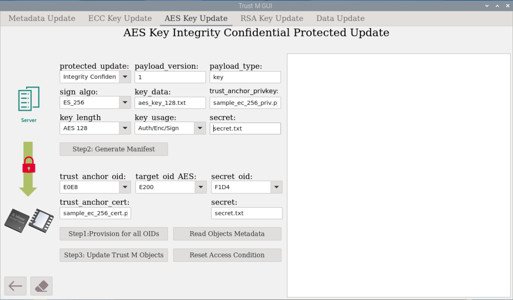

[^Figure 23]:AES Key Protected Update Screen

## AES Key Protected Update Functions

Description of the Steps to do a successful Protected Update of OPTIGA™ Trust M AES Key Objects.

### AES: Step 1 (Provisioning for All OIDs)

For Step 1, the "Trust anchor OID" is used to store the trust anchor and the data object type is set to Trust Anchor. The Protected Update Secret is written to the data object of "Secret OID " and the Data type will be set to UPDATESEC . The metadata of target OID will be set according during Provisioning. 

Trust Anchor OID options: *0xE0E8 - 0XE0E9* , Target OID options: *0xE200*

Secret OID options: *0xF1D0, 0xF1D4 - 0xF1DB*

In this example we will Provision for all OIDs. Select the "Trust anchor OID: E0E8", "Target OID AES: E200", "Secret OID: F1D4". Then select the secret file to be used to store into the Secret OID and the Trust anchor Cert file to be used to store into Trust anchor OID by clicking the respective textboxes. 


[^Figure 24]:Selection of Trust Anchor Certificate and Input Secret file

To Provision,  Select "Step1: Provisioning for All OIDs". In this example, after provisioning, the access condition *change* of target OID should be set to *Int-0xE0E8&&Conf-0xF1D4*.

```shell
Provisioning Data Objects ... 
Provisioning for initial Trust Anchor OID... 
========================================================
OPTIGA execution time: 0.3872 sec.
Success!!!
========================================================
'trustm_cert -w 0xE0E8 -i /home/pi/optiga-trust-m-explorer/Python_TrustM_GUI/linux-optiga-trust-m/scripts/certificates/sample_ec_256_cert.pem' executed 
......
========================================================
Symmetric Key [0xe200] 
OPTIGA execution time: 0.1042 sec.
[Size 0030] : 
	20 1C C0 01 01 C1 02 00 00 D0 07 21 E0 E8 FD 20 
	F1 D4 D1 01 00 D3 01 00 E0 01 83 E1 01 13 
	LcsO:0x01, Version:0000, Change:Int-0xE0E8&&Conf-0xF1D4, Read:ALW, Execute:ALW, Algorithm:AES256, Key Type:Auth/Enc/Sign, 

========================================================
'trustm_metadata --r 0xE200 executed 
++++++++++++++++++++++++++++++++++++++++++++
``` 

Expected Output (Partial): Provisioning for AES key Protected Update


### AES: Step 2 (Generate Manifest and Fragment)

Generate the manifest and fragment for the AES key Protected Update.

To generate the Manifest and fragment, Enter the "payload version" and select the "key_data" you want to update into AES key slot.

Choose the trust_anchor_privkey (Corresponding to trust_anchor_cert)and also the secret file (same with the secret stored inside  "Secret OID")

Select the "Step2 : Generate Manifest" button.  In this example the "payload version" is set to 1 and the payload_type is  key and key data used is the aes_128_test.txt file and the secret used is secret.txt file.

The Manifest and Fragment Generation are based on all the input inside the red box. For more information for this part, refer to  [protected update data set](https://github.com/Infineon/linux-optiga-trust-m/tree/development_v3/ex_protected_update_data_set) 

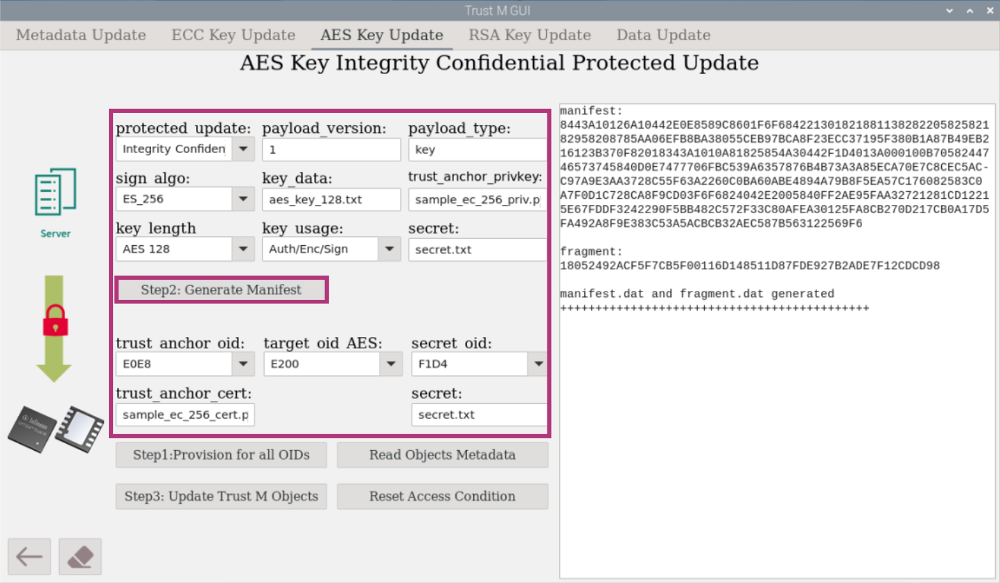

[^Figure 25]: AES Manifest and Fragment generated 

### AES: Step 3 Protected Update for AES Key 

Updates the AES key for the AES Key OID

To Update the AES key for the target OID, Select "Step3: Update Trust M Objects". 

```shell
AES Key protected update for Target OID... 

========================================================
OID            : 0xE200
Manifest File Name : manifest.dat 
Manifest : 
	84 43 A1 01 26 A1 04 42 E0 E8 58 9C 86 01 F6 F6 
	84 22 13 01 82 18 81 13 82 82 20 58 25 82 18 29 
	......
Fragment File Name     : fragment.dat 
final fragment : 
	18 05 24 92 AC F5 F7 CB 5F 00 11 6D 14 85 11 D8 
	7F DE 92 7B 2A DE 7F 12 CD CD 98 
OPTIGA execution time: 0.5890 sec.
AES Key protected update Successful.

========================================================
++++++++++++++++++++++++++++++++++++++++++++
```

Expected Output (Partial):AES Key Protected Update successfully

### Read AES Key Objects Metadata

Displays the metadata of the "Trust Anchor OID: E0E8", "Target OID AES: E200" and "Secret OID: F1D4".

To read out metadata , select "Read Objects Metadata".

```shell
Reading Objects Metadata... 
Reading out metadata for trust_anchor_oid... 

========================================================
Root CA Public Key Cert1    [0xE0E8] 
OPTIGA execution time: 0.1074 sec.
[Size 0027] : 
......
Symmetric Key [0xe200] 
OPTIGA execution time: 0.1032 sec.
[Size 0030] : 
	20 1C C0 01 01 C1 02 00 01 D0 07 21 E0 E8 FD 20 
	F1 D4 D1 01 00 D3 01 00 E0 01 81 E1 01 13 
	LcsO:0x01, Version:0001, Change:Int-0xE0E8&&Conf-0xF1D4, Read:ALW, Execute:ALW, Algorithm:AES128, Key Type:Auth/Enc/Sign, 

========================================================
'trustm_metadata -r 0xE200' executed 
++++++++++++++++++++++++++++++++++++++++++++
```

Expected Output (Partial): Read out objects metadata

### Reset AES Key Access Condition

Resets the Access Condition  *Change* of the Target OID to *LCS <0x07* so that the Target OID will be accessible for use in other features after a successful Protected Update and not locked.

```shell
Resetting Access Condition tag for Target OID... 
access_reset.bin generated
Writing metadata for Target OID... 
'trustm_metadata -w 0xE200 -F access_reset.bin' executed 
++++++++++++++++++++++++++++++++++++++++++++
Reading Objects Metadata... 
Reading out metadata for trust_anchor_oid... 

========================================================
Root CA Public Key Cert1    [0xE0E8] 
......
Symmetric Key [0xe200] 
OPTIGA execution time: 0.1097 sec.
[Size 0026] : 
	20 18 C0 01 01 C1 02 00 01 D0 03 E1 FC 07 D1 01 
	00 D3 01 00 E0 01 81 E1 01 13 
	LcsO:0x01, Version:0001, Change:LcsO<0x07, Read:ALW, Execute:ALW, Algorithm:AES128, Key Type:Auth/Enc/Sign, 

========================================================
'trustm_metadata -r 0xE200' executed 
++++++++++++++++++++++++++++++++++++++++++++
```

Expected Output (Partial): AES Target OID access condition reset successfully

# RSA Key Protected Update

This section shows the use of the  OPTIGA™ Trust M Integrity and Confidential Protected Update for RSA Key OIDs by using the Trust Anchor and Secret installed in the OPTIGA™ Trust M.

1. Select "RSA Key Update"
2. Overview of the "RSA Key Update" tab.

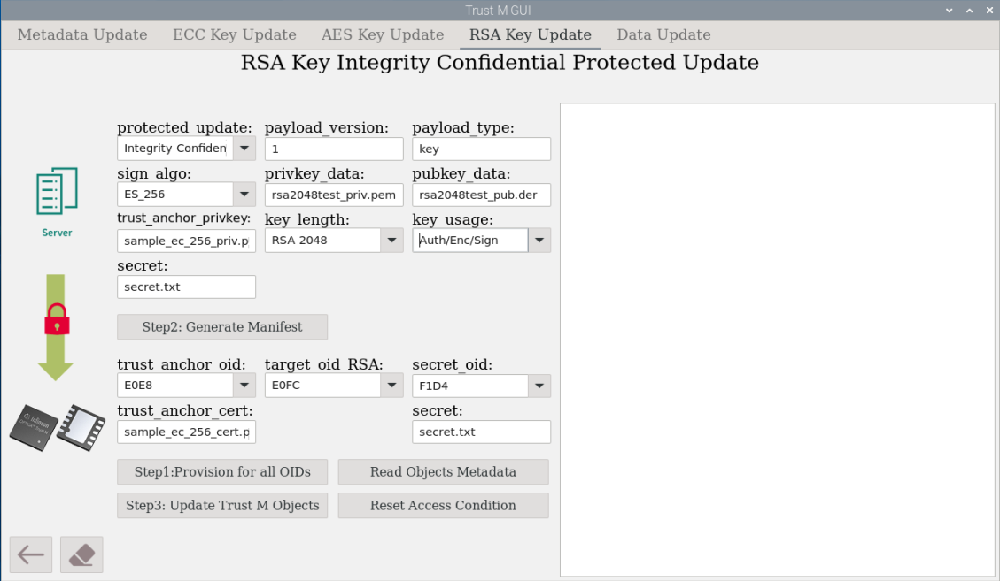

[^Figure 26]:RSA Key Protected Update screen

## RSA Key Protected Update Functions

Description of the Steps to do a successful Protected Update of OPTIGA™ Trust M RSA Key Objects.

### RSA: Step 1 (Provisioning for All OIDs)

For Step 1, the "Trust anchor OID" is used to store the trust anchor and the data object type is set to Trust Anchor. The Protected Update Secret is written to the data object of "Secret OID " and the Data type will be set to UPDATESEC . The metadata of target OID will be set according during Provisioning. 

Trust Anchor OID options: *0xE0E8 - 0XE0E9* , Target OID options: *0xE0FC - 0xE0FD,*

Secret OID options: *0xF1D0, 0xF1D4 - 0xF1DB*

In this example we will Provision for all OIDs. Select the "Trust anchor OID: E0E8", "Target OID: E0FC", "Secret OID: F1D4". Then select the secret file to be used to provision the Secret OID and the Trust anchor Cert file to be used by clicking the respective textboxes. 


[^Figure 27]:Selection of Trust Anchor Certificate and Input Secret file

To Provision,  Select "Step1: Provisioning for All OIDs". In this example, after provisioning, the access condition *change* of target OID should be set to *Int-0xE0E8&&Conf-0xF1D4*

```shell
Provisioning Data Objects ... 
Provisioning for initial Trust Anchor OID... 
========================================================
OPTIGA execution time: 0.3139 sec.
Success!!!
========================================================
'trustm_cert -w 0x0xE0E8 -i /home/pi/optiga-trust-m-explorer/Python_TrustM_GUI/linux-optiga-trust-m/scripts/certificates/sample_ec_256_cert.pem' executed 
++++++++++++++++++++++++++++++++++++++++++++
......
Device RSA Private Key x         [0xE0FC] 
OPTIGA execution time: 0.1041 sec.
[Size 0033] : 
	20 1F C0 01 01 C1 02 00 00 D0 07 21 E0 E8 FD 20 
	F1 D4 D1 01 00 D3 01 00 D8 01 FF E0 01 42 E1 01 
	13 
	LcsO:0x01, Version:0000, Change:Int-0xE0E8&&Conf-0xF1D4, Read:ALW, Execute:ALW, MUD:NEV, Algorithm:RSA2048, Key Type:Auth/Enc/Sign, 

========================================================
'trustm_metadata --r 0xE0FC executed 
++++++++++++++++++++++++++++++++++++++++++++

```

Expected Output (Partial): Provisioning for RSA Key Protected Update 

### RSA: Step 2 (Generate Manifest and Fragment)

Generate the manifest and fragment for the RSA key Protected Update.

To generate the Manifest and fragment, Enter the "payload version" and select the "privkey_data" and "pubkey_data" you want to import into OPTIGA™ Trust M

Choose the trust_anchor_privkey (Corresponding to trust_anchor_cert)and also the secret file (same with the secret stored inside  "Secret OID")

Select the "Step2 : Generate Manifest" button.  In this example the "payload version" is set to 1 and the payload_type is set to key. The private key data used is the rsa2048test_priv.pem file and the corresponding public key data is stored in the rsa2048test_pub.der file. The secret used is secret.txt file. 

The Manifest and Fragment Generation are based on all the input inside the red box. For more information for this part, refer to [protected update data set](https://github.com/Infineon/linux-optiga-trust-m/tree/development_v3/ex_protected_update_data_set) 

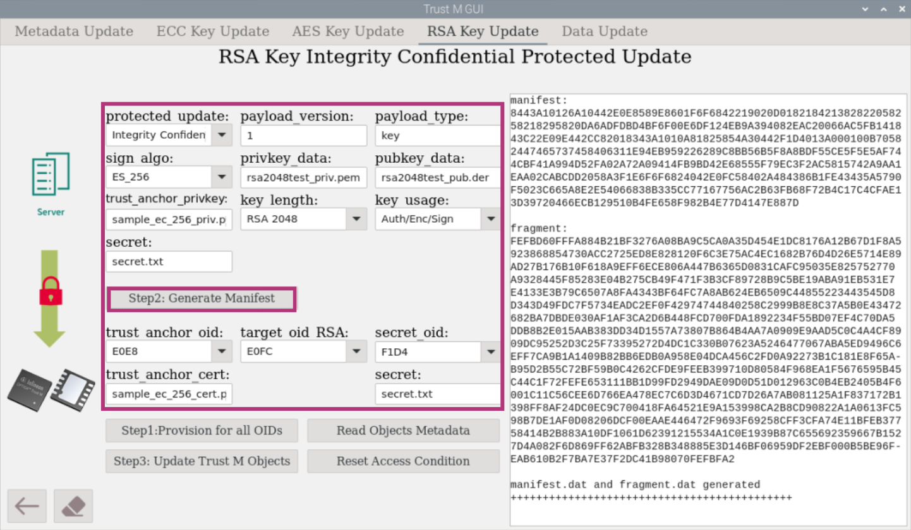

[^Figure 28]: RSA Manifest generated 

### RSA: Step 3 Protected Update for the RSA Key 

Updates the RSA key for the target OID

To Update the metadata of the target OID, Select "Step3: Update Trust M Objects". 

```shell
RSA Key protected update for Target OID... 

Bypass Shielded Communication. 
========================================================
OID            : 0xE0FC
Manifest File Name : manifest.dat 
Manifest : 
	84 43 A1 01 26 A1 04 42 E0 E8 58 9E 86 01 F6 F6 
	84 22 19 02 0D 01 82 18 42 13 82 82 20 58 25 82 
	......
Fragment File Name     : fragment.dat 
final fragment : 
	FE FB D6 0F FF A8 84 B2 1B F3 27 6A 08 BA 9C 5C 
	A0 A3 5D 45 4E 1D C8 17 6A 12 B6 7D 1F 8A 59 23 
	......
OPTIGA execution time: 0.5763 sec.
RSA Key protected update Successful.

========================================================
'trustm_protected_update_rsakey -k 0xE0FC -m manifest.dat -f fragment.dat' executed 
'trustm_data -w 0xF1E0 -i rsa2048test_pub.der -e' executed 
++++++++++++++++++++++++++++++++++++++++++++
```

Expected Output (Partial): RSA Key Protected Update successful

### Read RSA Key Objects Metadata

Displays the metadata of the "Trust Anchor OID: E0E8", "Target OID: E0FC" and "Secret OID: F1D3".

To read out metadata , select "Read Objects Metadata".

```shellReading Objects Metadata... 
Reading out metadata for trust_anchor_oid... 

========================================================
Root CA Public Key Cert1    [0xE0E8] 
......
Device RSA Private Key x         [0xE0FC] 
OPTIGA execution time: 0.1082 sec.
[Size 0033] : 
	20 1F C0 01 01 C1 02 00 01 D0 07 21 E0 E8 FD 20 
	F1 D4 D1 01 00 D3 01 00 D8 01 FF E0 01 42 E1 01 
	13 
	LcsO:0x01, Version:0001, Change:Int-0xE0E8&&Conf-0xF1D4, Read:ALW, Execute:ALW, MUD:NEV, Algorithm:RSA2048, Key Type:Auth/Enc/Sign, 

========================================================
'trustm_metadata -r 0xE0FC' executed 
++++++++++++++++++++++++++++++++++++++++++++
```

Expected Output (Partial): Read Out object metadata

### Reset RSA Key Access Condition

Resets the Access Condition of the Target OID *Change* to *LCS <0x07* so that the Target OID will be accessible for use in other features after a successful Protected Update and not locked. 

```shellResetting Access Condition tag for Target OID... 
00000000: 2005 d003 e1fc 07                        ......
access_reset.bin generated
Writing metadata for Target OID... 
'trustm_metadata -w 0xE0FC -F access_reset.bin' executed 
++++++++++++++++++++++++++++++++++++++++++++
Reading Objects Metadata... 
......
Device RSA Private Key x         [0xE0FC] 
OPTIGA execution time: 0.1025 sec.
[Size 0029] : 
	20 1B C0 01 01 C1 02 00 01 D0 03 E1 FC 07 D1 01 
	00 D3 01 00 D8 01 FF E0 01 42 E1 01 13 
	LcsO:0x01, Version:0001, Change:LcsO<0x07, Read:ALW, Execute:ALW, MUD:NEV, Algorithm:RSA2048, Key Type:Auth/Enc/Sign, 

========================================================
'trustm_metadata -r 0xE0FC' executed 
++++++++++++++++++++++++++++++++++++++++++++
```

Expected Output (Partial): RSA key Target OID access condition is reset successfully

# Data Protected Update

This section shows the use of the  OPTIGA™ Trust M Integrity and Confidential Protected Update for data of OIDs by using the Trust Anchor and Secret installed in the OPTIGA™ Trust M.

1. Select "Data Update"
2. Overview of the "Data Update" tab.

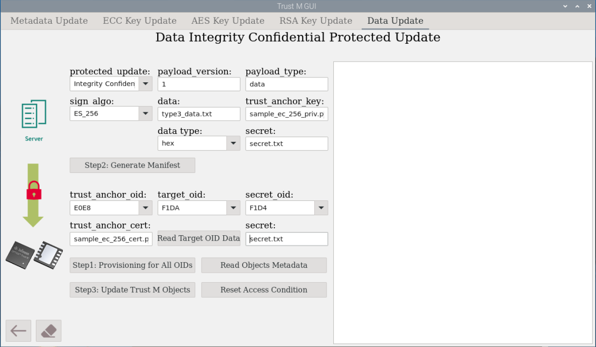

[^Figure 29]:Data Protected Update screen

## Data Protected Update Functions

Description of the Steps to do a successful Protected Update of OPTIGA™ Trust M Data Objects.

### Data Update: Step 1 (Provisioning for All OIDs)

For Step 1, the "Trust anchor OID" is used to store the trust anchor and the data object type is set to Trust Anchor. The Protected Update Secret is written to the data object of "Secret OID " and the Data type will be set to UPDATESEC . The metadata of target OID will be set accordingly during Provisioning. 

Trust Anchor OID options: *0xE0E8 - 0xE0E9, 0xE0EF*, Target OID options: *0xF1D0 - 0xF1DB, 0xF1E0 - 0xF1E1, 0xE0E1 - 0xE0E3*

Secret OID options: *0xF1D0, 0xF1D4 - 0xF1DB*

In this example we will Provision for all OIDs. Select the "Trust anchor OID: E0E8", "Target OID: F1E0", "Secret OID: F1D4". Then select the secret file to be used to provision the Secret OID and the Trust anchor Cert file to be used by clicking the respective textboxes. 


[^Figure 30]:Selection of Trust Anchor Certificate and Input Secret file

To Provision,  Select "Step1: Provisioning for All OIDs". In this example, after provisioning, the access condition *change* of target OID should be set to *Int-0xE0E8&&Conf-0xF1D4*

```shellProvisioning Data Objects ... 
Provisioning Data Objects ... 
Provisioning for initial Trust Anchor OID... 
========================================================
OPTIGA execution time: 0.3222 sec.
Success!!!
========================================================
'trustm_cert -w 0x0xE0E8 -i /home/xinyu/optiga-trust-m-explorer/Python_TrustM_GUI/linux-optiga-trust-m/scripts/certificates/sample_ec_256_cert.pem' executed 
......
App DataStrucObj type 2     [0xF1E0] 

	20 03 C0 01 03 
	LcsO:0x03, 
OPTIGA execution time: 0.1693 sec.
Write Success.
========================================================
'trustm_metadata -w 0xF1E0 -I' executed 
++++++++++++++++++++++++++++++++++++++++++++
```

Expected Output (Partial): Provisioning for Data Protected Update 

### Data Update: Step 2 (Generate Manifest and Fragment)

Generate the manifest and fragment for the Data Protected Update.

To generate the Manifest and fragment, Enter the "payload version" and select the "data" file you want to import into OPTIGA™ Trust M

Choose the trust_anchor_key (Corresponding to trust_anchor_cert) and also the secret file (same with the secret stored inside  "Secret OID")

Choose the correct data type representation in *data type* box
> For data file containing hex value strings, choose *data type* to be *hex*, and for data file containing ASCII strings, choose *data type* to be *ascii*

Select the "Step2 : Generate Manifest" button.  In this example the "payload version" is set to 1 and the payload_type is set to *data* and data used is the *type3_data,txt* file and the secret used is secret.txt file. 

The Manifest and Fragment Generation are based on all the input inside the red box. For more information for this part, refer to [protected update data set](https://github.com/Infineon/linux-optiga-trust-m/tree/development_v3/ex_protected_update_data_set) 


[^Figure 31]: Data and Manifest generated 

### Data Update: Step 3 Protected Update for the target OID 

Updates the Data for the target OID

To Update the data of the target OID, Select "Step3: Update Trust M Objects". In the example, "Trust anchor OID: E0E8", "Target OID: F1E0", "Secret OID: F1D4".

```shell
Data protected update for Target OID... 

========================================================
OID            : 0xF1E0
File Name : manifest.dat 
Manifest : 
	84 43 A1 01 26 A1 04 42 E0 E8 58 9D 86 01 F6 F6 
	84 20 19 01 30 01 82 00 02 82 82 20 58 25 82 18 
	...... 
File Name     : fragment_0.dat 
Final fragment : 
	19 F4 79 21 18 94 82 FC 3D BD 6C 81 2C 0C AD 43 
	81 4A 20 8F 23 17 39 91 C7 EE 17 27 C4 E7 15 01 
	......
OPTIGA execution time: 0.9418 sec.
Data protected update Successful.

========================================================
'trustm_protected_update -k 0xF1E0 -m manifest.dat -f fragment_0.dat' executed 
++++++++++++++++++++++++++++++++++++++++++++
```


[^Figure 123]:Data Protected Update successful

### Read Data Objects Metadata

Displays the metadata of the "Trust Anchor OID", "Target OID" and "Secret OID".

To read out metadata , select "Read Objects Metadata".

```shell
Reading Objects Metadata... 
Reading out metadata for trust_anchor_oid... 

========================================================
Root CA Public Key Cert1    [0xE0E8] 
OPTIGA execution time: 0.1131 sec.
[Size 0027] : 
	20 19 C0 01 01 C4 02 04 B0 C5 02 02 5C D0 03 E1 
	FC 07 D1 01 00 D3 01 00 E8 01 11 
	LcsO:0x01, Max Size:1200, Used Size:604, Change:LcsO<0x07, Read:ALW, Execute:ALW, Data Type:TA, 

========================================================
'trustm_metadata -r 0xE0E8' executed 
++++++++++++++++++++++++++++++++++++++++++++
Reading out metadata for secret_oid... 

========================================================
App DataStrucObj type 3     [0xF1D4] 
OPTIGA execution time: 0.1094 sec.
[Size 0037] : 
	20 23 C0 01 03 C1 02 00 00 C4 01 8C C5 01 40 D0 
	03 E1 FC 07 D1 03 E1 FC 07 D3 01 00 D8 01 FF E8 
	01 23 F0 01 01 
	LcsO:0x03, Version:0000, Max Size:140, Used Size:64, Change:LcsO<0x07, Read:LcsO<0x07, Execute:ALW, MUD:NEV, Data Type:UPDATSEC, Reset Type:SETCRE, 

========================================================
'trustm_metadata -r 0xF1D4' executed 
++++++++++++++++++++++++++++++++++++++++++++
Reading out metadata for target_oid... 

========================================================
App DataStrucObj type 2     [0xF1E0] 
OPTIGA execution time: 0.1237 sec.
[Size 0029] : 
	20 1B C0 01 03 C1 02 00 00 C4 02 05 DC C5 02 01 
	30 D0 07 21 E0 E8 FD 20 F1 D4 D1 01 00 
	LcsO:0x03, Version:0000, Max Size:1500, Used Size:304, Change:Int-0xE0E8&&Conf-0xF1D4, Read:ALW, 

========================================================
'trustm_metadata -r 0xF1E0' executed 
++++++++++++++++++++++++++++++++++++++++++++
```

Expected Output: Read Out object metadata

### Reset Target OID Access Condition

Resets the Access Condition of the Target OID *Change* to *LCS <0x07* so that the Target OID will be accessible for use in other features after a successful Protected Update and not locked. 

```shell
Resetting Access Condition tag for Target OID... 
00000000: 2005 d003 e1fc 07                        ......
access_reset.bin generated
Writing metadata for Target OID... 
'trustm_metadata -w 0xF1E0 -F access_reset.bin' executed 
++++++++++++++++++++++++++++++++++++++++++++
```

Expected Output: Target OID access condition is reset successfully


# Secure Storage

## Secure Storage Functions

Secure Storage Functions Description

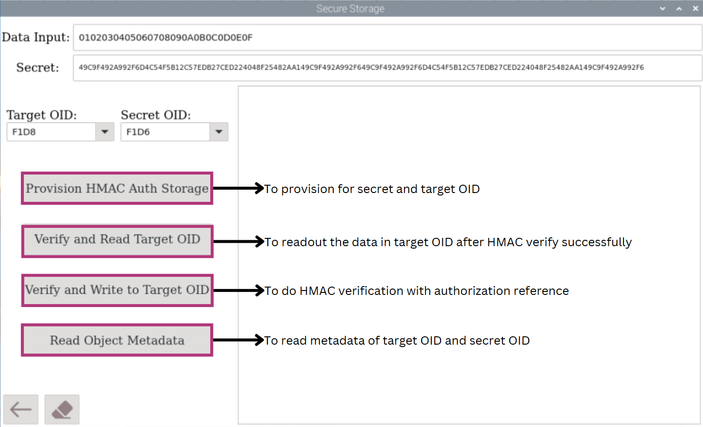

[^Figure 32]: Secure Storage functions described

### Provision For HMAC Authentication

To do provision for the initial data, metadata and shared secret for HMAC authenticated secure storage.

The Secret Input will be provisioned into the "Secret OID", and the Data Type of "Secret OID" will be set to AUTHREF.

The data only can be read out/write in when HMAC Authentication successful since the access condition has been set to Change: Auto-0xSecret OID, Read: Auto-Secret OID.

Target OID options: *0xF1D7 - 0xF1DB*, *0xF1E0 - 0xF1E1* , Secret OID options: *0xF1D7 - 0xF1D9*

To Provision , Select the "Target OID"(F1D8 in this example) and "Secret OID"(F1D6 in this example). Then select "Provision HMAC Auth Storage".

```shell
Provisioning initial data, metadata and shared secret for HMAC authenticated secure storage access... 
Writing binary read access LcsO<0x07 metadata as metadata of Secret OID... 
'python3 hex_to_binary.py {SHARED_SECRET_META} > secret_autoref_metadata.bin' executed 

========================================================
App DataStrucObj type 3     [0xF1D6] 

	20 11 C0 01 01 D0 03 E1 FC 07 D1 01 00 D3 01 00 
	E8 01 31 
	LcsO:0x01, Change:LcsO<0x07, Read:ALW, Execute:ALW, Data Type:AUTHREF, 
OPTIGA execution time: 0.1223 sec.
Write Success.
......
App DataStrucObj type 3     [0xF1D8] 

	20 0A D0 03 23 F1 D6 D1 03 23 F1 D6 
	Change:Auto-0xF1D6, Read:Auto-0xF1D6, 
OPTIGA execution time: 0.1228 sec.
Write Success.
========================================================
'trustm_metadata -w 0xF1D8 -Cf:data_object_auto_metadata.bin -Rf:data_object_auto_metadata.bin' executed 
++++++++++++++++++++++++++++++++++++++++++++
```

Expected Output (Partial): Provisioning HMAC authentication storage

### HMAC Verify and Write

To write data into Target OID after HMAC verify successfully.

The secret entered will be verified against the secret provisioned into the "Secret OID". HMAC verification will be successful if they match.

To write the data into the "Target OID" , Select the "Target OID" and "Secret OID", then select "Verify and Write to Target OID". In this example the Target OID is "0xF1D9" and the Secret OID is "0xF1D7".

```shell
Writing data into Target OID if HMAC verification is successful... 

Converting data input to binary data.dat...
'python3 hex_to_binary.py {DATA_OBJECT} > data.dat' executed 
'python3 hex_to_binary.py {secretin}  > secret.dat' executed 
0102030405060708090A0B0C0D0E0F
Input Secret OID: 0xF1D6
Target OID: 0xF1D8
========================================================
HMAC Type         : 0x0020 
Input secret : 
	49 C9 F4 92 A9 92 F6 D4 C5 4F 5B 12 C5 7E DB 27 
	CE D2 24 04 8F 25 48 2A A1 49 C9 F4 92 A9 92 F6 
	49 C9 F4 92 A9 92 F6 D4 C5 4F 5B 12 C5 7E DB 27 
	CE D2 24 04 8F 25 48 2A A1 49 C9 F4 92 A9 92 F6 
	
OPTIGA execution time: 0.1359 sec.
HMAC verified successfully 
Input data : 
	01 02 03 04 05 06 07 08 09 0A 0B 0C 0D 0E 0F 
Write new data into target OID successfully 
========================================================
'trustm_hmac_verify_Auth -I 0xF1D6 -s secret.dat -w 0xF1D8 -i data.dat 

0102030405060708090A0B0C0D0E0F
```

Expected Output : Verify and Write to Target OID 

### HMAC Verify and Read

To read out data stored in Target OID after HMAC verify successfully

The secret entered will be verified against the secret provisioned into the "Secret OID". HMAC verification will be successful if they match.

To readout the data in the Target OID, Select the "Target OID" and "Secret OID", then select "Verify and Read Target OID" . In this example the Target OID is "F1D9" and the Secret OID is "F1D7".\

```shell
Reading out data from Target OID if HMAC verification is successful... 
'python3 hex_to_binary.py {secretin} > secret.dat' executed 

Input Secret OID: 0xF1D6
Target OID: 0xF1D8
========================================================
HMAC Type         : 0x0020 
Input secret : 
	49 C9 F4 92 A9 92 F6 D4 C5 4F 5B 12 C5 7E DB 27 
	CE D2 24 04 8F 25 48 2A A1 49 C9 F4 92 A9 92 F6 
	49 C9 F4 92 A9 92 F6 D4 C5 4F 5B 12 C5 7E DB 27 
	CE D2 24 04 8F 25 48 2A A1 49 C9 F4 92 A9 92 F6 
	
OPTIGA execution time: 0.1359 sec.
HMAC verified successfully 
Output the data stored inside target OID. 
Output File Name : data_F1D8.bin 
Read data from target OID successfully 
Data inside target OID :
	01 02 03 04 05 06 07 08 09 0A 0B 0C 0D 0E 0F 
========================================================
'trustm_hmac_verify_Auth -I 0xF1D6 -s secret.dat -r 0xF1D8 -o data_F1D8.bin' executed 
++++++++++++++++++++++++++++++++++++++++++++
```

Expected Output: Verify and read Target OID

### Read Objects Metadata

Displays the metadata of the "Target OID" and "Secret OID".

To read out metadata , select "Read Object Metadata".

```shell
Reading Objects Metadata... 

Reading out metadata for secret_oid... 

========================================================
App DataStrucObj type 3     [0xF1D6] 
OPTIGA execution time: 0.1365 sec.
[Size 0041] : 
	20 27 C0 01 01 C1 02 00 03 C4 01 8C C5 01 40 D0 
	03 E1 FC 07 D1 01 00 D3 01 00 D8 07 21 E0 E8 FD 
	20 F1 D4 E8 01 31 F0 01 11 
	LcsO:0x01, Version:0003, Max Size:140, Used Size:64, Change:LcsO<0x07, Read:ALW, Execute:ALW, MUD:Int-0xE0E8&&Conf-0xF1D4, Data Type:AUTHREF, Reset Type:SETCRE/FLUSH, 

========================================================
'trustm_metadata -r 0xF1D6' executed 
++++++++++++++++++++++++++++++++++++++++++++
Reading out metadata for target_oid... 

========================================================
App DataStrucObj type 3     [0xF1D8] 
OPTIGA execution time: 0.1450 sec.
[Size 0037] : 
	20 23 C0 01 03 C1 02 00 00 C4 01 8C C5 01 0F D0 
	03 23 F1 D6 D1 03 23 F1 D6 D3 01 00 D8 01 FF E8 
	01 21 F0 01 01 
	LcsO:0x03, Version:0000, Max Size:140, Used Size:15, Change:Auto-0xF1D6, Read:Auto-0xF1D6, Execute:ALW, MUD:NEV, Data Type:PRESSEC, Reset Type:SETCRE, 

========================================================
'trustm_metadata -r 0xF1D8' executed 
++++++++++++++++++++++++++++++++++++++++++++
```

Expected Output: Read Objects metadata displayed
